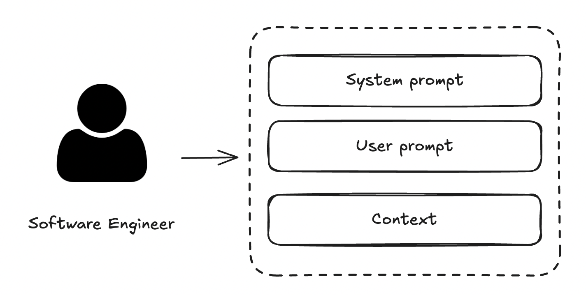
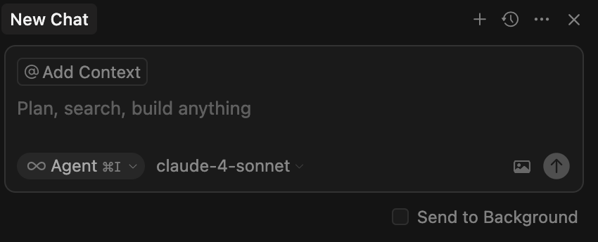
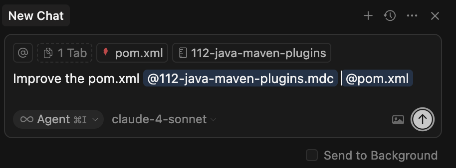
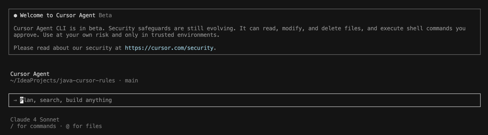
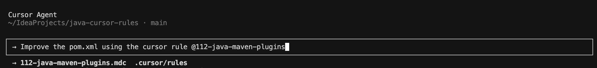
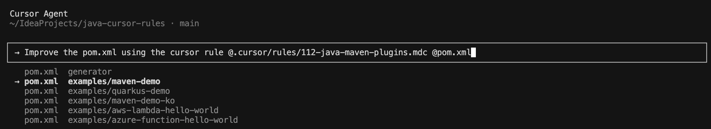

# How to use a System prompt in your development?




Using a System prompt in your development is pretty easy, if you are using a Modern IDE which includes AI features, like Cursor, open the chat:



and type your own **User prompt**, like the following example:

```
Improve the pom.xml using the cursor rule @112-java-maven-plugins
```

and add `drag and drop` the system prompt that you need into the chat and the pom.xml file.

The result should be:



---

Recently appear another way to interact models, in this case using CLI tools, the approach is exactly the same.

Starting from a clean session from [Cursor CLI](https://cursor.com/cli):



Type in the text area your user Prompt:

```
Improve the pom.xml using the cursor rule @112-java-maven-plugins
```



and finally select the file which you want to apply the process:


