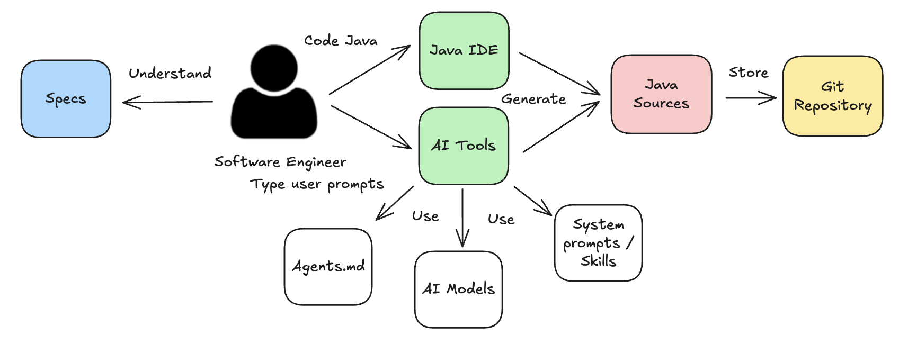

# Cursor AI rules for Java

## Stargazers over time
[](https://starchart.cc/jabrena/cursor-rules-java)

[](https://github.com/jabrena/cursor-rules-java/actions/workflows/maven.yaml)

## Share your feedback

```bash
╔══════════════════════════════════════════════════════════════╗
║ ┌──────────────────────────────────────────────────────────┐ ║
║ │ Tu feedback es importante para evolucionar este proyecto │ ║
║ │    Your feedback is important to evolve this project     │ ║
║ │                您的反馈对本项目的发展至关重要                 │ ║
║ │           https://forms.gle/TpNXENjmu45wuXoi6            │ ║
║ └──────────────────────────────────────────────────────────┘ ║
╚══════════════════════════════════════════════════════════════╝
```

[https://forms.gle/TpNXENjmu45wuXoi6](https://forms.gle/TpNXENjmu45wuXoi6)

## Goal

The project provides a collection of `System prompts` & `Skills` for Java Enterprise development that help software engineers and pipelines in their daily programming work.
The [available System prompts for Java](./SYSTEM-PROMPTS-JAVA.md) cover aspects like `Build system based on Maven`, `Design`, `Coding`, `Testing`, `Refactoring & JMH Benchmarking`, `Performance testing with JMeter`, `Profiling with Async profiler/OpenJDK tools`, `Documentation`, `Diagrams` & `AGENTS.md`.

## Deliverables

The project generates a set of deliverables at the end of any iteration.

- System prompts for Java located in `.cursor/rules`
- Skills for Java located in `skills`

### How many System prompts for Java does this project include?

Explore the [complete catalog of available System prompts](./SYSTEM-PROMPTS-JAVA.md) to discover the full range of capabilities and find the perfect rules for your specific use cases.

### How many AI Skills for Java does this project include?

Explore the folder [skills](./skills) for further details.

## Getting started

Read the following comprehensive guides to use this project today.

- [Getting started with `System prompts for Java`](./documentation/GETTING-STARTED-SYSTEM-PROMPTS.md)
- [Getting started with `Skills for Java`](./documentation/GETTING-STARTED-SKILLS.md)
- [Getting started with `Pipelines and AI`](./documentation/GETTING-STARTED-PIPELINES.md)

## How to use them?

The SLDC has evolved with the arrival of this new set of AI tooling, enhancing the Software Engineering process. The project provides `System prompts for Java` & `Skills for Java` to improve the LLM Behaviour when a model tries to complete Java tasks. In the development of this project, it was identified 2 different workflows: `Enginering Java development workflow` & `Pipelines workflow`.

### Enginering Java development workflow

Adding AI tools to the Java development workflow can increase the likelihood of implementing software specifications on time and with quality.



In this workflow, you could delegate completely a task or ask help in certain moments. You could use this project to refactor the code generated or delegate the task and associate a System prompt / Skills to that task

### Pipelines workflow

Adding AI tools to your pipeline can provide new opportunities to deliver more value (examples: automatic coding, code refactoring, continuous profiling, and others).


## Limitations

### Lack of determinism

From the outset, be aware that the results provided by interactions with the different `Cursor rules` are not deterministic due to the nature of the models, but this can be mitigated with clear goals and validation checkpoints.

### Limits of interactions with models

Models are able to generate code, but they cannot run code with your local data. To address this limitation, some prompts provide scripts to bridge this gap on the model side.

## Compatibility with Modern IDEs, CLI & Others

The repository was designed to support Cursor, but other tools have evolved and now offer better support for system prompts. The repository runs regular regression tests for IDEs and tools such as *Cursor*, *Cursor CLI*, *Claude Code*, *GitHub Copilot*, and *JetBrains Junie*.

⚠️ **Note:** Currently, the best environments in which to use this repository are *Cursor*, *Cursor CLI*, and *Claude Code*. If you use *JetBrains IntelliJ IDEA*, you can combine it with *Cursor CLI* or *Claude Code*. Further information is available in the latest review [here](./documentation/reviews/review-20250829.md) (**Last update:** 2025/08/29).

## Contribute

If you have great ideas, [read the following document](./CONTRIBUTING.md) to contribute.

## Examples

The repository includes [a collection of examples](./examples/) where you can explore the possibilities of these system prompts designed for Java.

## Architectural decision records, ADR

- [ADR-001: Generate Cursor Rules from XML Files](./documentation/adr/ADR-001-generate-cursor-rules-from-xml-files.md)
- [ADR-002: Configure Cursor Rules Manual Scope](./documentation/adr/ADR-002-configure-cursor-rules-manual-scope.md)
- [ADR-003: Website Generation with JBake](./documentation/adr/ADR-003-website-generation-with-jbake.md)

## Changelog

- Review the [CHANGELOG](./CHANGELOG.md) for further details

## Java JEPS from Java 8

Java uses JEPs as the vehicle to describe new features to be added to the language. The repository continuously reviews which JEPs could improve any of the cursor rules present in this repository.

- [JEPS List](./documentation/jeps/All-JEPS.md)

## Meetups, Conferences, Workshops & Articles

### Codemotion / Madrid (2026/04/20)

- [Taller técnico sobre Cursor para el desarrollo con Java](https://conferences.codemotion.com/madrid/speakers/)

### W-JAX / Munich (2025/11/06 - 10:30 - 11:30)

- [https://jax.de/generative-ai-ecosystem/cursor-ai-101-java-enterprise/](https://jax.de/generative-ai-ecosystem/cursor-ai-101-java-enterprise/)

### Devoxx BE / Antwerp (2025/10/07 - 18:20 - 18:50)

- [https://m.devoxx.com/events/dvbe25/talks/4715/the-power-of-cursor-rules-in-java-enterprise-development](https://m.devoxx.com/events/dvbe25/talks/4715/the-power-of-cursor-rules-in-java-enterprise-development)

### Blogs

- [Delegating Java tasks to Supervised AI Dev Pipelines](https://www.javaadvent.com/2025/12/delegating-java-tasks-to-supervised-ai-dev-pipelines.html)
- https://virtuslab.com/blog/ai/providing-library-documentation/
- https://www.linkedin.com/pulse/september-rest-story-jvm-weekly-vol-146-artur-skowro%C5%84ski-82lif/?trackingId=wbWPSL65TpCCbdg5ksAWjw%3D%3D

## References

- [https://agents.md/](https://agents.md/)
- [https://www.cursor.com/](https://www.cursor.com/)
- [https://cursor.com/cli](https://cursor.com/cli)
- [https://docs.cursor.com/context/rules](https://docs.cursor.com/context/rules)
- [https://docs.cursor.com/context/@-symbols/@-cursor-rules](https://docs.cursor.com/context/@-symbols/@-cursor-rules)
- https://agentskills.io/home
- https://github.com/anthropics/skills
- https://skills.sh/
- https://cursor.com/docs/cli/github-actions
- https://code.claude.com/docs/en/github-actions
- [https://www.anthropic.com/claude-code](https://www.anthropic.com/claude-code)
- [https://github.com/features/copilot](https://github.com/features/copilot)
- [https://www.jetbrains.com/junie/](https://www.jetbrains.com/junie/)
- [https://openjdk.org/jeps/0](https://openjdk.org/jeps/0)

## Cursor rules ecosystem

- [https://github.com/jabrena/101-cursor](https://github.com/jabrena/101-cursor)
- [https://github.com/jabrena/pml](https://github.com/jabrena/pml)
- [https://github.com/jabrena/cursor-rules-agile](https://github.com/jabrena/cursor-rules-agile)
- [https://github.com/jabrena/cursor-rules-java](https://github.com/jabrena/cursor-rules-java)
- [https://github.com/jabrena/cursor-rules-spring-boot](https://github.com/jabrena/cursor-rules-spring-boot)
- [https://github.com/jabrena/cursor-rules-examples](https://github.com/jabrena/cursor-rules-examples)
- [https://github.com/jabrena/plantuml-to-png-cli](https://github.com/jabrena/plantuml-to-png-cli)
- [https://github.com/jabrena/setup-cli](https://github.com/jabrena/setup-cli)

Powered by [Cursor](https://www.cursor.com/) with ❤️ from [Madrid](https://www.google.com/maps/place/Community+of+Madrid,+Madrid/@40.4983324,-6.3162283,8z/data=!3m1!4b1!4m6!3m5!1s0xd41817a40e033b9:0x10340f3be4bc880!8m2!3d40.4167088!4d-3.5812692!16zL20vMGo0eGc?entry=ttu&g_ep=EgoyMDI1MDgxOC4wIKXMDSoASAFQAw%3D%3D)
