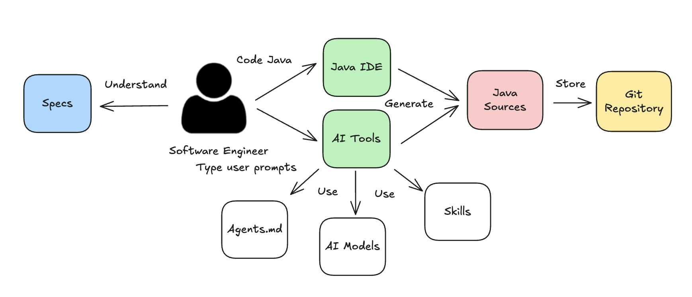
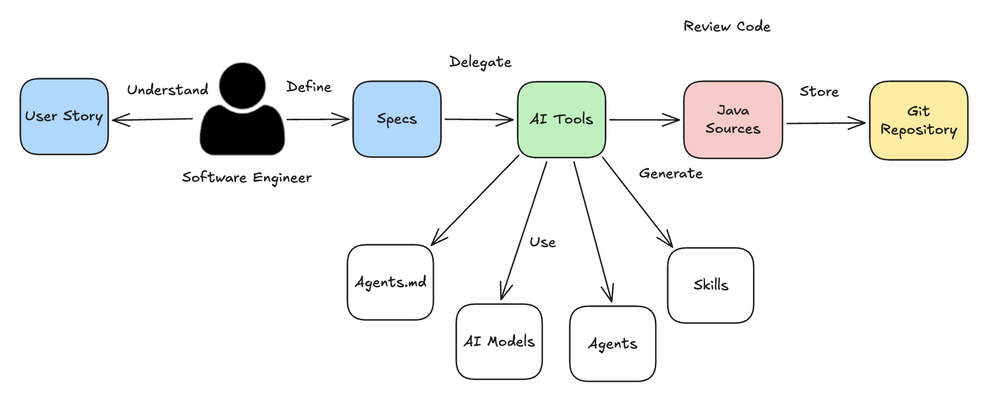
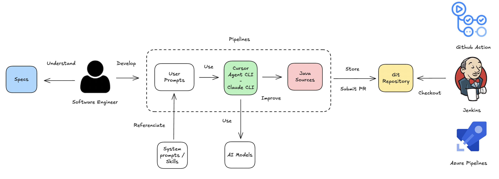

# Skills & Agents para Java

> **Idiomas:** [English](./README.md) · [中文](./README_CN.md)
>
> **Website:** https://jabrena.github.io/cursor-rules-java/
>
> **Apoya el proyecto:** [Sponsor to pay tokens](https://github.com/sponsors/jabrena)

## Objetivo

Un flujo de trabajo nativo de IA, con criterio propio, para evolucionar las prácticas modernas de `SDLC` en Java Enterprise mediante `Skills`, `Agents` y servidores `MCP` reutilizables.

Con este proyecto aprenderás a resolver los [Five whys](https://en.wikipedia.org/wiki/Five_whys) usando tu harness de AI Agent favorito:

| PREGUNTA   | ROL                | ÁREA             | SOPORTE                                                                                                                                                                                                             |
| ---------- | ------------------ | ---------------- | ------------------------------------------------------------------------------------------------------------------------------------------------------------------------------------------------------------------- |
| QUÉ / CUÁNDO | PO, BA, EA, SA, TL | Agile & Planning | `User Stories`, `GitHub Issues` y `Jira` |
| POR QUÉ    | EA, SL, TL         | Architecture     | `ADRs` y diagramas `UML` / `C4` / `ER` |
| CÓMO | SA, TL, SWE | Spec-Driven      | `AI Plan mode` y `OpenSpec` |
| CÓMO       | TL, SWE            | Java development | `Build system based on Maven`, `Design`, `Coding`, `Testing`, `Observability`, `Refactoring & JMH Benchmarking`, `Performance testing with JMeter`, `Profiling with Async profiler/OpenJDK tools`, `Documentation`, `Spring Boot`, `Quarkus`, `Micronaut`, `OpenAPI`, `WireMock` y `AGENTS.md` |

## Entregables

El proyecto genera un conjunto de entregables al final de cualquier iteración.

| Inventario     | Instalación                                                                                    | Primeros pasos                                                                           |
| --------------- | -------------------------------------------------------------------------------------------- | ----------------------------------------------------------------------------------------- |
| 1. [Skills for Java](./documentation/guides/INVENTORY-SKILLS-JAVA.md) | `npx skills add jabrena/cursor-rules-java --all --agent cursor` | [`Skills for Java`](./documentation/guides/GETTING-STARTED-SKILLS_ES.md)     |
| 2. [Agents for Java](./documentation/guides/INVENTORY-AGENTS-JAVA.md) | `@003-agents-installation` Instalar Agents en Cursor/Claude | [`Agents for Java`](./documentation/guides/GETTING-STARTED-AGENTS_ES.md)     |

**⚠️ Nota:** Si sigues usando los System prompts/rules de este proyecto, revisa [el artículo](https://jabrena.github.io/cursor-rules-java/blog/2026/04/release-0.14.0.html). Los `System prompts/rules` actuales se eliminarán en la próxima versión (v0.16.0).

### Compatibilidad

Este proyecto es compatible con cualquier herramienta que admita `Skills`, `Agents`, `AGENTS.md` y `MCP Servers`.

## ¿Cómo usar el proyecto?

El SDLC ha evolucionado con esta nueva ola de herramientas de IA, que mejora el proceso de ingeniería de software. Según la fase en la que te encuentres, puedes usar distintos `Skills`, `Agents` o `MCP Servers`. Consulta la siguiente tabla de ejemplo para entender la idea:

|               | Análisis / Diseño | Implementación | Operación |
| ------------- | ----------------- | -------------- | --------- |
| [Skills](./documentation/guides/GETTING-STARTED-SKILLS_ES.md)        | [014-agile-user-story](https://www.skills.sh/jabrena/cursor-rules-java/014-agile-user-story) · [030-architecture-adr-general](https://www.skills.sh/jabrena/cursor-rules-java/030-architecture-adr-general) · [031-architecture-adr-functional-requirements](https://www.skills.sh/jabrena/cursor-rules-java/031-architecture-adr-functional-requirements) · [033-architecture-diagrams](https://www.skills.sh/jabrena/cursor-rules-java/033-architecture-diagrams) · [041-planning-plan-mode](https://www.skills.sh/jabrena/cursor-rules-java/041-planning-plan-mode) | [110-java-maven-best-practices](https://www.skills.sh/jabrena/cursor-rules-java/110-java-maven-best-practices) · [121-java-object-oriented-design](https://www.skills.sh/jabrena/cursor-rules-java/121-java-object-oriented-design) · [124-java-secure-coding](https://www.skills.sh/jabrena/cursor-rules-java/124-java-secure-coding) · [111-java-maven-dependencies](https://www.skills.sh/jabrena/cursor-rules-java/111-java-maven-dependencies) · [143-java-functional-exception-handling](https://www.skills.sh/jabrena/cursor-rules-java/143-java-functional-exception-handling) | [151-java-performance-jmeter](https://www.skills.sh/jabrena/cursor-rules-java/151-java-performance-jmeter) · [162-java-profiling-analyze](https://www.skills.sh/jabrena/cursor-rules-java/162-java-profiling-analyze) · [161-java-profiling-detect](https://www.skills.sh/jabrena/cursor-rules-java/161-java-profiling-detect) · [163-java-profiling-refactor](https://www.skills.sh/jabrena/cursor-rules-java/163-java-profiling-refactor) · [164-java-profiling-verify](https://www.skills.sh/jabrena/cursor-rules-java/164-java-profiling-verify) |
| [Agents](./documentation/guides/GETTING-STARTED-AGENTS_ES.md)        | `@robot-business-analyst` | `@robot-coordinator` · `@robot-java-coder` · `@robot-spring-boot-coder` · `@robot-quarkus-coder` · `@robot-micronaut-coder` |  |
| [MCP Servers](./documentation/guides/THIRD-PARTIES.md)   | [JDBC](https://github.com/quarkiverse/quarkus-mcp-servers/blob/main/jdbc/README.md) | [JavaDocs](https://www.javadocs.dev/mcp) · [Serena](https://oraios.github.io/serena/01-about/000_intro.html) | [Graphana](https://grafana.com/docs/grafana/latest/developer-resources/mcp/) |

## Flujos de trabajo

Al construir este proyecto identificamos tres flujos de trabajo: `Prompting Engineering Workflow`, `Agent-driven Engineering Workflow`, `Pipelines Workflow`.

### Prompting Engineering Workflow

En este flujo, el ingeniero de software interactúa con los modelos mediante `User prompts`. De forma incremental, delegas una tarea completa o pides ayuda en puntos concretos. Puedes usar este proyecto para refactorizar código generado, o delegar la tarea y adjuntar un system prompt o Skills.

### Agent-driven Engineering Workflow

Los `Agents for Java Enterprise development` están pensados para ayudar al ingeniero de software en la fase de implementación. El ingeniero define `Specs` sólidas y esas especificaciones se delegan a los `Agents`.

### Pipelines Workflow

Añadir herramientas de IA a tu pipeline puede abrir nuevas oportunidades para aportar más valor (por ejemplo: codificación automática, refactorización de código, perfilado continuo y otros).

Más información [aquí](./documentation/guides/GETTING-STARTED-PIPELINES_ES.md).

## Limitaciones

### Falta de determinismo

Desde el principio, ten presente que los resultados de las interacciones con estos `Skills` y agents no son deterministas por el comportamiento de los modelos, pero puedes mitigarlo con objetivos claros y puntos de validación.

### No todos los modelos se comportan igual

Algunos skills interactivos requieren modelos `Premium` para uso interactivo; de lo contrario siguen una secuencia fija de pasos.

### Límites de las interacciones con modelos

Los modelos pueden generar código, pero no pueden ejecutarlo contra tus datos locales. Para cerrar esa brecha, algunos Skills incluyen scripts que ejecutas localmente.

## Contribuir

Consulta [CONTRIBUTING.md](./CONTRIBUTING.md) para convenciones, flujos del generador, pruebas y cómo abrir un pull request.

## Ejemplos

El repositorio incluye [una colección de ejemplos](./examples/) donde puedes explorar lo que estos Skills y flujos de trabajo permiten en Java.

## Architecture Decision Records (ADR)

- Revisa el [índice de ADR](./documentation/adr/README.md) para la lista completa.

## Changelog

- Revisa el [CHANGELOG](./CHANGELOG.md) para más detalles.

## Java JEPs desde Java 8

Java usa JEPs (JDK Enhancement Proposals) para describir nuevas características del lenguaje y la plataforma. Este repositorio hace seguimiento de qué JEPs podrían mejorar los Skills y la guía aquí incluida.

- [Lista de JEPs](./documentation/jeps/All-JEPS.md)

## Meetups, conferencias, talleres y artículos

### Codemotion / Madrid (2026/04/20 - 11:00 - 12:30)

- [Taller técnico sobre Cursor para el desarrollo con Java](https://conferences.codemotion.com/madrid/speakers/)

### W-JAX / Munich (2025/11/06 - 10:30 - 11:30)

- [https://jax.de/generative-ai-ecosystem/cursor-ai-101-java-enterprise/](https://jax.de/generative-ai-ecosystem/cursor-ai-101-java-enterprise/)

### Devoxx BE / Antwerp (2025/10/07 - 18:20 - 18:50)

- [https://m.devoxx.com/events/dvbe25/talks/4715/the-power-of-cursor-rules-in-java-enterprise-development](https://m.devoxx.com/events/dvbe25/talks/4715/the-power-of-cursor-rules-in-java-enterprise-development)

### Madrid Jug / Madrid (2025/05/06 - 19:00)

- [https://www.meetup.com/es-ES/madridjug/events/307458529/](https://www.meetup.com/es-ES/madridjug/events/307458529/)

### Blogs

- [Delegating Java tasks to Supervised AI Dev Pipelines](https://www.javaadvent.com/2025/12/delegating-java-tasks-to-supervised-ai-dev-pipelines.html)
- [https://vibekode.it/blog/cursor-ai-developer-cloud-platform/](https://vibekode.it/blog/cursor-ai-developer-cloud-platform/)
- [https://www.linkedin.com/pulse/september-rest-story-jvm-weekly-vol-146-artur-skowro%C5%84ski-82lif/?trackingId=wbWPSL65TpCCbdg5ksAWjw%3D%3D](https://www.linkedin.com/pulse/september-rest-story-jvm-weekly-vol-146-artur-skowro%C5%84ski-82lif/?trackingId=wbWPSL65TpCCbdg5ksAWjw%3D%3D)
- [https://virtuslab.com/blog/ai/providing-library-documentation/](https://virtuslab.com/blog/ai/providing-library-documentation/)

## Referencias

- [https://www.cursor.com/](https://www.cursor.com/)
- [https://cursor.com/cli](https://cursor.com/cli)
- [https://www.anthropic.com/claude-code](https://www.anthropic.com/claude-code)
- [https://github.com/features/copilot](https://github.com/features/copilot)
- [https://cursor.com/docs/cli/github-actions](https://cursor.com/docs/cli/github-actions)
- [https://code.claude.com/docs/en/github-actions](https://code.claude.com/docs/en/github-actions)
- [https://agents.md/](https://agents.md/)
- [https://agentskills.io/home](https://agentskills.io/home)
- [https://microsoft.github.io/language-server-protocol/](https://microsoft.github.io/language-server-protocol/)
- [https://openspec.dev/](https://openspec.dev/)
- [https://skills.sh/jabrena/cursor-rules-java](https://skills.sh/jabrena/cursor-rules-java)
- [https://tessl.io/registry/skills/github/jabrena/cursor-rules-java](https://tessl.io/registry/skills/github/jabrena/cursor-rules-java)
- https://agent-skills.cc/zh/skills/jabrena-cursor-rules-java
- [https://github.com/vercel-labs/skills/issues](https://github.com/vercel-labs/skills/issues)
- [https://openjdk.org/jeps/0](https://openjdk.org/jeps/0)
- [https://jbake.org/docs/latest/](https://jbake.org/docs/latest/)
- https://developers.redhat.com/blog/2016/12/09/spring-cloud-for-microservices-compared-to-kubernetes

## Otros desarrollos

- [https://github.com/jabrena/pml](https://github.com/jabrena/pml)
- [https://github.com/jabrena/cursor-rules-java](https://github.com/jabrena/cursor-rules-java)
- https://github.com/jabrena/ai-agent-harness-monitor-cli
- [https://github.com/jabrena/setup-cli](https://github.com/jabrena/setup-cli)

Powered by [Cursor](https://www.cursor.com/) & [Codex](https://openai.com/codex/) with ❤️ from [Madrid](https://www.google.com/maps/place/Community+of+Madrid,+Madrid/@40.4983324,-6.3162283,8z/data=!3m1!4b1!4m6!3m5!1s0xd41817a40e033b9:0x10340f3be4bc880!8m2!3d40.4167088!4d-3.5812692!16zL20vMGo0eGc?entry=ttu&g_ep=EgoyMDI1MDgxOC4wIKXMDSoASAFQAw%3D%3D)
