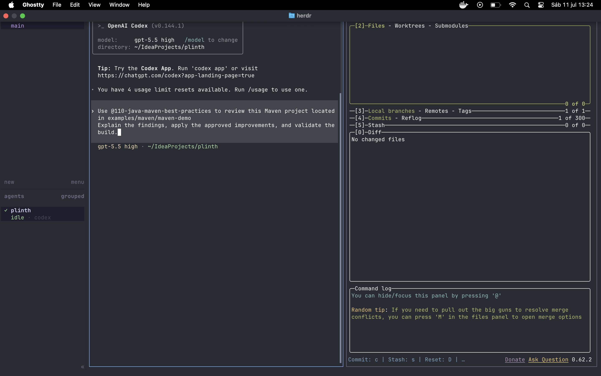

# Plinth para Java

<a href="https://trendshift.io/repositories/15013" target="_blank"></a>

[](https://github.com/jabrena/plinth/actions/workflows/maven.yaml)

> **Idiomas:** [English](./README.md) · [中文](./README_ZH.md)
>
> **Ayuda a crecer este proyecto:** [Conviértete en patrocinador](https://github.com/sponsors/jabrena)

## Objetivo

Un flujo de trabajo nativo de IA, con criterio propio, para evolucionar las prácticas modernas de `SDLC` en Java Enterprise mediante `Skills`, `Agents`, `Commands` y servidores `MCP` reutilizables.

## ¿Qué es un Plinth?

> Un `plinth` representa la base sólida o plataforma usada para sostener estatuas u obras de arte en el arte y la escultura. Servía como fundamento estructural y simbólico para columnas, estatuas y podios completos de templos. Los romanos heredaron la idea de la arquitectura griega, pero ampliaron su uso para enfatizar la monumentalidad, la jerarquía y el poder imperial.

## Proyecto de un vistazo

- 14 Commands
- 9 Agents
- 125 Skills

## Últimas actualizaciones

Explora el contenido publicado más reciente en https://jabrena.github.io/plinth/ y sigue su evolución mediante nuevos skills, mejoras y correcciones en el [CHANGELOG](./CHANGELOG.md).

## Empieza en 60 segundos

Instala todos los skills para tu agente preferido:

```bash
# Cursor
npx skills add jabrena/plinth --skill '*' --agent cursor -y

# Claude Code
npx skills add jabrena/plinth --skill '*' --agent claude-code -y

# Codex
npx skills add jabrena/plinth --skill '*' --agent codex -y

# GitHub Copilot
npx skills add jabrena/plinth --skill '*' --agent github-copilot -y
```

## Refactoriza tu código con Skills

El proyecto ofrece un conjunto completo de Agent Skills para el desarrollo Java Enterprise que cubre aspectos como: `Sistema de build basado en Maven`, `Diseño`, `Programación`, `Testing`, `Observabilidad`, `Refactoring y benchmarking con JMH`, `Pruebas de rendimiento con JMeter/Gatling`, `Profiling con Async Profiler/herramientas de OpenJDK`, `Documentación`, `Spring Boot`, `Quarkus`, `Micronaut`, `OpenAPI`, `WireMock`, `Docker`, `SQL/NoSQL`, `Seguridad` y `AGENTS.md`.

**Ejemplo de prompt de usuario:**

```text
Usa @110-java-maven-best-practices para revisar este proyecto Maven ubicado en examples/@maven/maven-demo
Explica los hallazgos, aplica las mejoras aprobadas y valida el build.
```



El skill guía al agente mediante una revisión estructurada de Maven mientras tú mantienes el control sobre los cambios propuestos.

## Onboarding en 5 minutos

Aprende a usar este proyecto siguiendo la guía rápida [Primeros pasos en 5 minutos](./documentation/guides/GETTING-STARTED-IN-5-MINUTES_ES.md).

## Elige tu camino

Los commands componen el flujo de trabajo dirigiendo cada tarea al agente y al conjunto de skills adecuados:

```text
/onboarding
  |
  v
Incidencia
  |
  v
/update-issue --> /explore-problem --> /create-acceptance-criteria
  |
  v
/create-spec --> /explore-design
  |
  v
/implement-spec --> /close-spec
```

`/onboarding` establece el archivo `AGENTS.md` en la raíz y un único proyecto OpenSpec no ambiguo antes de seleccionar una incidencia. Conserva los prerrequisitos existentes; si falta OpenSpec, eliges la ruta resultante con `documentation/openspec` como valor predeterminado.

### Análisis y diseño

Convierte una idea en un cambio accionable mediante user stories, GitHub Issues o Jira, ADRs, diagramas, AI plan mode y OpenSpec.

**Especificación funcional:**

<table>
  <thead>
    <tr>
      <th>Comando</th>
      <th>Explicación</th>
    </tr>
  </thead>
  <tbody>
    <tr>
      <td><code>/onboarding</code></td>
      <td>Establece las instrucciones del repositorio raíz y un único proyecto OpenSpec no ambiguo antes de trabajar con incidencias.</td>
    </tr>
    <tr>
      <td><code>/update-issue</code></td>
      <td>Actualiza una incidencia existente de GitHub o Jira con una historia de usuario estructurada, criterios de aceptación y contenido de recursos.</td>
    </tr>
    <tr>
      <td><code>/explore-problem</code></td>
      <td>Evalúa una incidencia desde cinco perspectivas y publica en ella un comentario de especificación funcional.</td>
    </tr>
    <tr>
      <td><code>/create-acceptance-criteria</code></td>
      <td>Deriva criterios de aceptación Gherkin de una especificación funcional y los publica como un comentario independiente en la incidencia.</td>
    </tr>
  </tbody>
</table>

**Especificación técnica:**

<table>
  <thead>
    <tr>
      <th>Comando</th>
      <th>Explicación</th>
    </tr>
  </thead>
  <tbody>
    <tr>
      <td><code>/create-adr</code> (Opcional)</td>
      <td>Registra una decisión arquitectónica, sus alternativas, su justificación y sus consecuencias.</td>
    </tr>
    <tr>
      <td><code>/create-diagram</code> (Opcional)</td>
      <td>Crea un diagrama de arquitectura o diseño específico a partir de artefactos aprobados.</td>
    </tr>
    <tr>
      <td><code>/create-spec</code> (OpenSpec)</td>
      <td>Crea o actualiza uno o más cambios OpenSpec validados.</td>
    </tr>
    <tr>
      <td><code>/explore-design</code></td>
      <td>Compara enfoques técnicos y obtiene la aprobación de una dirección de diseño.</td>
    </tr>
  </tbody>
</table>

### Construir

Implementa y mejora aplicaciones Java con orientación sobre Maven, diseño, programación, pruebas, seguridad, documentación, Spring Boot, Quarkus, Micronaut, OpenAPI y WireMock.

<table>
  <thead>
    <tr>
      <th>Comando</th>
      <th>Explicación</th>
    </tr>
  </thead>
  <tbody>
    <tr>
      <td><code>/implement-spec</code></td>
      <td>Entrega un plan aprobado o una lista de tareas OpenSpec validada mediante delegación adaptada al framework.</td>
    </tr>
    <tr>
      <td><code>/close-spec</code></td>
      <td>Archiva por nombre un cambio OpenSpec mediante la CLI de OpenSpec.</td>
    </tr>
  </tbody>
</table>

### Operar

Mide y mejora el comportamiento en producción mediante observabilidad, profiling, benchmarking y pruebas de rendimiento.

<table>
  <thead>
    <tr>
      <th>Comando</th>
      <th>Explicación</th>
    </tr>
  </thead>
  <tbody>
    <tr>
      <td><code>/profile</code></td>
      <td>Coordina el profiling de Java desde la detección de la línea base hasta la optimización verificada.</td>
    </tr>
    <tr>
      <td><code>/benchmark</code></td>
      <td>Selecciona y coordina flujos de trabajo de rendimiento con JMeter, Gatling o JMH.</td>
    </tr>
  </tbody>
</table>

### Cumplimiento (Alpha)

Revisa sistemas Java, modelos de IA y cómo se utilizan las herramientas de IA generativa en aplicaciones y pipelines de entrega para identificar controles de ingeniería, evidencias y derivaciones a responsables cualificados relacionados con IA, datos, seguridad, producto, plataforma, mercado y gobernanza. **<u>Estos skills apoyan la concienciación técnica y no proporcionan asesoramiento jurídico.</u>**

| Regulación | Skill |
| --- | --- |
| [EU AI Act](https://eur-lex.europa.eu/legal-content/EN/TXT/HTML/?uri=OJ:L_202401689) | `801-regulations-eu-ai-act` |
| [DORA](https://eur-lex.europa.eu/legal-content/EN/TXT/HTML/?uri=CELEX:32022R2554) | `802-regulations-dora` |
| [GDPR](https://eur-lex.europa.eu/legal-content/EN/TXT/HTML/?uri=CELEX:32016R0679) | `803-regulations-gdpr` |
| [NIS2](https://eur-lex.europa.eu/legal-content/EN/TXT/HTML/?uri=CELEX:32022L2555) | `804-regulations-eu-nis2` |
| [Cyber Resilience Act](https://eur-lex.europa.eu/legal-content/EN/TXT/HTML/?uri=CELEX:32024R2847) | `805-regulations-eu-cyber-resilience-act` |
| [Data Act](https://eur-lex.europa.eu/legal-content/EN/TXT/HTML/?uri=CELEX:32023R2854) | `806-regulations-eu-data-act` |
| [Digital Services Act](https://eur-lex.europa.eu/legal-content/EN/TXT/HTML/?uri=CELEX:32022R2065) | `807-regulations-eu-digital-services-act` |
| [Digital Markets Act](https://eur-lex.europa.eu/legal-content/EN/TXT/HTML/?uri=CELEX:32022R1925) | `808-regulations-eu-digital-markets-act` |
| [MiFID II](https://eur-lex.europa.eu/eli/dir/2014/65/oj/eng) | `810-regulations-eu-mifid-ii` |
| [Market Abuse Regulation](https://eur-lex.europa.eu/eli/reg/2014/596/oj/eng) | `811-regulations-eu-market-abuse-regulation` |
| [Product Liability Directive](https://eur-lex.europa.eu/eli/dir/2024/2853/oj/eng) | `812-regulations-eu-product-liability-directive` |

**Nota:** Este conjunto de skills podría ser un buen complemento para el futuro [OWASP EU Compliance MCP](https://genai.owasp.org/solution/eu-compliance-mcp/).

Explora los inventarios completos de [Commands](./documentation/guides/INVENTORY-COMMANDS-JAVA.md), [Agents](./documentation/guides/INVENTORY-AGENTS-JAVA.md), [Skills](./documentation/guides/INVENTORY-SKILLS-JAVA.md) y [MCP Servers](./documentation/guides/THIRD-PARTIES.md).

## Componentes del proyecto

El proyecto genera un conjunto de entregables al final de cualquier iteración.

| Inventario     | Instalación                                                                                    | Primeros pasos                                                                           |
| --------------- | -------------------------------------------------------------------------------------------- | ----------------------------------------------------------------------------------------- |
| 1. [Commands](./documentation/guides/INVENTORY-COMMANDS-JAVA.md) | `@004-commands-installation` Instalar Commands en el proyecto | [`Commands`](./documentation/guides/COMMANDS.md) |
| 2. [Agents](./documentation/guides/INVENTORY-AGENTS-JAVA.md) | `@005-agents-installation` Instalar Agents en Cursor/Claude | [`Agents`](./documentation/guides/GETTING-STARTED-AGENTS_ES.md)     |
| 3. [Skills](./documentation/guides/INVENTORY-SKILLS-JAVA.md) | `npx skills add jabrena/plinth --skill '*' --agent cursor -y` | [`Skills`](./documentation/guides/GETTING-STARTED-SKILLS_ES.md)     |

### Compatibilidad

Este proyecto es compatible con cualquier herramienta que admita `Commands`, `Agents`, `Skills`, `MCP Servers` y `AGENTS.md`.

## Validaciones de Skills

Cada push ejecuta las siguientes validaciones en [CI Builds](./.github/workflows/maven.yaml) para mantener la documentación y los skills generados correctos, consistentes y seguros:

| Nombre | Propósito |
| --- | --- |
| 1. [MarkdownValidator](./markdown-validator/src/main/java/info/jab/mv/MarkdownValidator.java) | Protege la capa de documentación al detectar desviaciones de parseo Markdown y fallos en enlaces remotos antes de las validaciones específicas de skills. |
| 2. [skill-check](https://github.com/thedaviddias/skill-check) | Confirma que cada skill generado cumple el contrato esperado de empaquetado, complementando los scanners centrados en comportamiento o riesgo de seguridad. |
| 3. [cisco-ai-skill-scanner](https://github.com/cisco-ai-defense/skill-scanner) de Cisco | Añade cobertura de seguridad orientada al comportamiento al buscar flujos de skills riesgosos que la validación estructural no puede ver. |
| 4. [SkillSpector](https://github.com/NVIDIA/SkillSpector) de NVIDIA | Aporta una revisión estática independiente de calidad y seguridad, útil para contrastar hallazgos con los otros scanners. |
| 5. [Snyk Agent Scan](https://github.com/snyk/agent-scan) de SNYK | Se centra en señales de cadena de suministro y riesgos de prompt en agent skills, añadiendo otra perspectiva de seguridad junto a Cisco y SkillSpector. |

## Limitaciones

### Falta de determinismo

Desde el principio, ten presente que los resultados de las interacciones con estos `Skills` y agents no son deterministas por el comportamiento de los modelos, pero puedes mitigarlo con objetivos claros y puntos de validación.

### No todos los modelos se comportan igual

Algunos skills interactivos requieren modelos `Premium` para uso interactivo; de lo contrario siguen una secuencia fija de pasos.

### Límites de las interacciones con modelos

Los modelos pueden generar código, pero no pueden ejecutarlo contra tus datos locales. Para cerrar esa brecha, algunos Skills incluyen scripts que ejecutas localmente.

### Los ingenieros de software deben permanecer en el proceso

Este proyecto apoya el trabajo de ingeniería de software, pero no sustituye el criterio profesional. Un ingeniero de software debe revisar, guiar y validar las decisiones, el código y los resultados generados por IA antes de utilizarlos.

### Acceso a datos corporativos

Actúa con precaución cuando un problema involucre bases de datos corporativas u otros datos sensibles de la organización. Antes de conceder acceso a un flujo de trabajo asistido por IA, evalúa los riesgos de autorización, privacidad, filtración, retención y modificación accidental de datos. Aplica acceso con privilegios mínimos, revisión humana, validación y monitorización. Consulta [OWASP GenAI Data Security Risks & Mitigations 2026](https://genai.owasp.org/resource/owasp-genai-data-security-risks-mitigations-2026/) y el nuevo conjunto de [skills sobre regulaciones de la UE](#cumplimiento-alpha).

## Contribuir

Consulta [CONTRIBUTING.md](./CONTRIBUTING.md) para conocer las formas de apoyar y mejorar el proyecto.

## Architecture Decision Records (ADR)

- Revisa el [índice de ADR](./documentation/adr/README.md) para la lista completa.

## Java JEPs desde Java 8

Java usa JEPs (JDK Enhancement Proposals) para describir nuevas características del lenguaje y la plataforma. Este repositorio hace seguimiento de qué JEPs podrían mejorar los Skills y la guía aquí incluida.

- [Lista de JEPs](./documentation/jeps/All-JEPS.md)

## Recursos adicionales

Las charlas, artículos, enlaces de referencia, portales de skills y proyectos relacionados están en [Referencias del proyecto](./documentation/guides/PROJECT-REFERENCES_ES.md).

Desarrollado por personas con el apoyo de [Cursor](https://www.cursor.com/) y [Codex](https://openai.com/codex/), con ❤️ desde [Madrid](https://www.google.com/maps/place/Community+of+Madrid,+Madrid/@40.4983324,-6.3162283,8z/data=!3m1!4b1!4m6!3m5!1s0xd41817a40e033b9:0x10340f3be4bc880!8m2!3d40.4167088!4d-3.5812692!16zL20vMGo0eGc?entry=ttu&g_ep=EgoyMDI1MDgxOC4wIKXMDSoASAFQAw%3D%3D)
