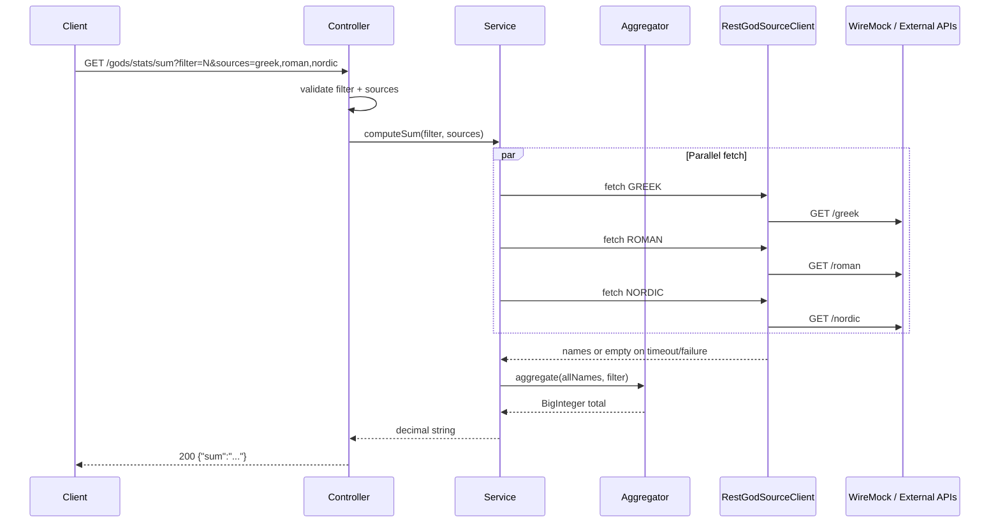

## Context

The API must combine data from three external mythology sources while keeping
client-facing behavior predictable when one or more sources are slow or
unavailable. The source ADRs select a Spring MVC servlet application with
Spring `RestClient`, no reactive stack, no automatic retries, and deterministic
WireMock-backed tests for timeout behavior.

Implementation target: `benchmarks/scenario4/demo/` (greenfield module).

External source payloads are JSON **arrays of god name strings** (see
`my-json-server-oas.yaml`), not nested objects.

## Goals / Non-Goals

**Goals:**

- Expose one REST endpoint that aggregates filtered god names across selected pantheons.
- Keep partial-result behavior predictable when individual sources time out or fail.
- Align implementation with Spring Boot 4.0.x, Spring MVC, and `RestClient`.
- Provide deterministic WireMock-backed tests for happy path and timeout scenarios.
- Keep domain logic (filter, conversion, sum) testable without HTTP or Spring context.

**Non-Goals:**

- Authentication, rate limiting, caching, circuit breakers, or automatic HTTP retries.
- Reactive stack (`WebClient`, WebFlux, Project Reactor).
- Rest Assured for HTTP-level acceptance tests.
- Hexagonal/clean-architecture ceremony beyond what simple design rules justify.

## Success Criteria

- All scenarios in `specs/god-analysis-api/spec.md` pass via Maven verification.
- Gherkin acceptance scenarios in `US-001_god_analysis_api.feature` pass when mapped to tests.
- OpenAPI contract in `US-001-god-analysis-api.openapi.yaml` matches runtime behavior.
- Timeout tests complete quickly using WireMock delays, not live network waits.

## Alternative Analysis

Evaluated with simple design rules (correctness → intention → duplication → fewest elements).

### A. Parallel source fetching

| Option | Assessment |
|--------|------------|
| **Sequential `RestClient` calls** | Rejected. Additive latency; violates ADR-002 performance expectations. |
| **`parallelStream()` over sources** | Rejected. Uses common fork-join pool; harder to reason about servlet thread + timeout isolation. |
| **`CompletableFuture.supplyAsync` on virtual-thread executor (SELECTED)** | Matches ADR-003. One task per source; bounded by configured read timeout; familiar blocking I/O inside each task. |
| **Reactive `WebClient` + `Flux.merge`** | Rejected. Conflicts with servlet-only architecture decision. |

### B. Application layering

| Option | Assessment |
|--------|------------|
| **Fat controller (all logic in `@RestController`)** | Rejected. Hides domain rules; hard to unit-test conversion/filter without MockMvc. |
| **Controller → service → `GodSourceClient` port + `RestClient` adapter (SELECTED)** | Clear responsibilities; pure domain in service; outbound HTTP isolated and swappable in tests. |
| **Full hexagonal modules (domain/application/infrastructure packages)** | Rejected for US-001. Extra packages and indirection without payoff for one endpoint. |

### C. Domain typing

| Option | Assessment |
|--------|------------|
| **Raw `String filter`, `List<String> sources`** | Acceptable at HTTP boundary only; weak validation story. |
| **`PantheonSource` enum + validated filter in service (SELECTED)** | `enum` for `greek|roman|nordic` reveals intent; filter validated once (exactly one code point). |
| **Rich value objects (`FilterCodePoint`, `GodName`, `AggregatedSum`)** | Optional follow-up if primitive obsession appears during refactor; not required for first slice. |

### D. Large integer handling

| Option | Assessment |
|--------|------------|
| **`long` / `Long` sum** | Rejected. Documented sums exceed 64-bit range. |
| **`BigInteger` internally, decimal string at boundary (SELECTED)** | Matches OpenAPI `pattern: ^[0-9]+$` and spec scenarios. |
| **`BigDecimal`** | Rejected. No fractional arithmetic; wrong semantic type. |

### E. HTTP-level acceptance tests

| Option | Assessment |
|--------|------------|
| **MockMvc only** | Rejected for Gherkin `@acceptance-test` scenarios. Does not exercise real TCP client path. |
| **Rest Assured** | Rejected per ADR-003 (Groovy/JVM fragility on Java 21+). |
| **`@SpringBootTest(RANDOM_PORT)` + Spring `RestClient` (SELECTED)** | Real HTTP to localhost; same client API as production outbound calls. |
| **WireMock for acceptance + MockMvc for validation** | **Hybrid (SELECTED).** MockMvc/`@WebMvcTest` for fast 400-path matrix; RestClient AT for 200 paths with WireMock upstream. |

## Recommended Architecture

### Component boundaries

```text
info.jab.ms
├── config
│   ├── GodAnalysisProperties      # URLs, connect/read timeouts (@ConfigurationProperties)
│   └── RestClientConfig           # RestClient bean with JdkClientHttpRequestFactory timeouts
├── web
│   ├── GodStatsController         # GET /api/v1/gods/stats/sum, query binding, 400 mapping
│   └── GlobalExceptionHandler     # @ControllerAdvice for validation errors → 400 + message
├── domain
│   ├── PantheonSource             # enum: GREEK, ROMAN, NORDIC (+ parse from comma list)
│   ├── GodNameFilter              # validates single code point, case-sensitive match
│   ├── UnicodeNameConverter       # name → concatenated code-point decimal → BigInteger
│   └── GodStatsAggregator         # orchestrates filter + convert + sum (pure, no HTTP)
├── integration
│   ├── GodSourceClient            # interface: fetchNames(PantheonSource) → List<String>
│   └── RestGodSourceClient        # RestClient GET, deserialize String[], swallow timeout → empty list
└── application
    └── GodStatsService            # parallel fetch, partial merge, delegate aggregation
```

### Data flow



### Failure handling

| Condition | Behavior |
|-----------|----------|
| Missing/empty/invalid `filter` or `sources` | HTTP 400 with error message (controller or `@ControllerAdvice`). |
| Unknown source key in `sources` | HTTP 400 before outbound calls. |
| Single source timeout or transport error | Log structured outcome; treat source as `[]`; continue aggregation. |
| All selected sources fail or time out | HTTP 200, `sum` = `"0"` (no matches). |
| Unexpected server fault | HTTP 500 allowed by OpenAPI but not required by acceptance tests; keep handler minimal. |

### Configuration

Single `application.yml` with `@ConfigurationProperties` prefix (e.g. `god-analysis`):

- `sources.greek-url`, `sources.roman-url`, `sources.nordic-url` (env overrides)
- `http.connect-timeout`, `http.read-timeout` (default 5000 ms)

Tests override URLs to point at WireMock dynamic ports via `@DynamicPropertySource` or test properties.

## Two-Step Implementation Sequence

Per two-step method (greenfield adaptation):

**Step 1 — Make the change easy (behavior-preserving scaffolding):**

- Create Spring Boot module skeleton (`info.jab.ms`), properties, `RestClient` bean.
- Introduce `GodSourceClient` interface and pure domain types (`UnicodeNameConverter`, `GodNameFilter`, `GodStatsAggregator`).
- Add characterization/unit tests for conversion (`Zeus` → `90101117115`) and filter rules before wiring HTTP.

**Step 2 — Intended behavior (vertical slices):**

- Wire controller + service + outbound client.
- Add validation, parallel fetch, partial aggregation, acceptance tests.

Validate after each step with Maven test subsets; no mixed broad refactor + behavior in one commit.

## Vertical Slices (Hamburger Method)

| Slice | Delivers | Verification |
|-------|----------|--------------|
| **S1 — Pure domain** | Filter + Unicode conversion + sum | Unit tests only |
| **S2 — HTTP contract + validation** | Endpoint exists; all `@error-handling` Gherkin → 400 | MockMvc / `@WebMvcTest` |
| **S3 — Single-source happy path** | One pantheon, real RestClient to WireMock | Integration test |
| **S4 — Full happy path** | Three sources, `sum=78179288397447443426` | `@acceptance-test` + RestClient |
| **S5 — Partial timeout** | Roman+Nordic delayed, `sum=78101109179220212216` | `@integration-test` + WireMock delays |
| **S6 — Ops polish** | Structured logging, OpenAPI doc, dependency guard | Manual + build checks |

## TDD Test List (initial)

Selected next-test order (red → green → refactor):

1. `UnicodeNameConverter` — `Zeus` → `90101117115`
2. `GodNameFilter` — case-sensitive first code point; `N` vs `n`
3. `GodStatsAggregator` — empty names → sum `0`
4. `PantheonSource.parse` — rejects `invalid,unknown`
5. `GodStatsControllerValidationTest` — each 400 scenario from Gherkin
6. `GodStatsAcceptanceTest` — happy path sum (WireMock fixtures)
7. `GodStatsTimeoutIntegrationTest` — partial sum with `fixedDelayMilliseconds` > read timeout
8. Cross-check: manual sum of known `N` names matches documented constants

**A-TRIP constraints:** WireMock `resetAll()` in `@BeforeEach`; separate stub mappings per pantheon; no shared mutable delay state across tests.

**CORRECT boundaries:** empty filter, multi-char filter, empty sources, invalid source keys, no-match filter → `"0"`, all-sources-timeout → `"0"`.

## Risks / Trade-offs

- **Partial results** → Consumers must tolerate variable logical completeness while the JSON contract stays stable.
- **No retries** → Transient upstream blips increase partial-result rate compared with a retry-enabled design.
- **Large integer sums** → Return `sum` as a decimal string to avoid JSON numeric precision loss.
- **String array deserialization** → Upstream returns `["Zeus", ...]`; use `String[].class` or parameterized type reference; document assumption in client adapter.
- **Parallel test execution** → Prefer one WireMock server per test class with dynamic port to avoid port collisions if Surefire parallelizes.

## ADR Candidates

No new ADRs required for US-001 — source ADRs already cover stack, NFRs, and testing choices.

Future ADRs (out of scope):

- Caching strategy if latency becomes a product concern.
- Retry policy if partial-result rate is unacceptable in production.
- Rest Assured re-evaluation only if upstream Groovy/JVM issue is resolved.

## Open Questions

1. **Error response shape:** OpenAPI allows flexible `ErrorResponse`. Recommend `{ "message": "..." }` for 400 responses — confirm before implementation.
2. **Duplicate source keys:** Should `sources=greek,greek` deduplicate or fetch twice? Recommend dedupe after parse (simpler, no double-counting). Not specified in sources — default to dedupe unless user prefers strict passthrough.
3. **Demo module layout:** Single Maven module under `benchmarks/scenario4/demo/` vs nested `demo/god-analysis-api/`. Recommend flat single module unless harness expects subdirectory — confirm preferred layout.

## Validation Strategy

- Unit-test Unicode conversion, filtering, source parsing, and aggregation (no Spring).
- `@WebMvcTest` or MockMvc for all HTTP 400 paths.
- `@SpringBootTest(RANDOM_PORT)` + Spring `RestClient` for acceptance 200 paths.
- WireMock in-process with `fixedDelayMilliseconds` for timeout scenarios; reset stubs between tests.
- Final gate: `./mvnw clean verify` in demo module + `openspec validate --all`.
