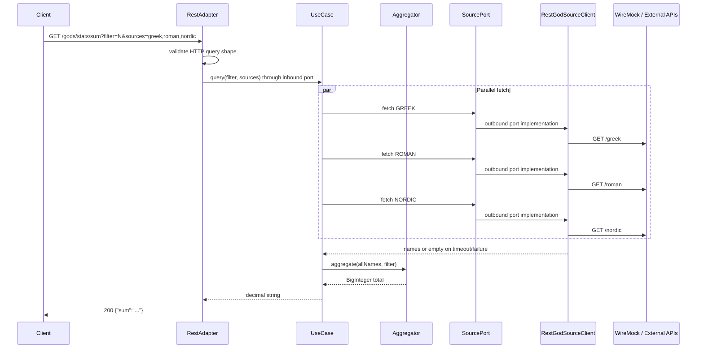

## Design status

**Design direction:** Spring Boot 4.1.0 servlet application with a small
**Hexagonal architecture** (`adapter.in.rest` → `application` ports/use cases →
`domain`, with `adapter.out.http` implementing outbound source ports), thin
driving adapter, application orchestration with `RestClient` hidden behind an
outbound port, pure domain rules, **`StructuredTaskScope`** parallel fetch, and
a hybrid test pyramid (MockMvc for 400 paths, WireMock + `RestClient` for
200/timeout paths).

This document refines the initial OpenSpec from `/create-spec`; it does not
replace proposal or spec authority.

## Context

The API must combine data from three external mythology sources while keeping
client-facing behavior predictable when one or more sources are slow or
unavailable. The source ADRs select a Spring MVC servlet application with
Spring `RestClient`, no reactive stack, no automatic retries, and deterministic
WireMock-backed tests for timeout behavior.

Implementation target: `benchmarks/scenario4/demo/` (greenfield module).

External source payloads are JSON **arrays of god name strings** (see
`my-json-server-oas.yaml`), not nested objects with `{ "name": "..." }` fields.
Each upstream path (`/greek`, `/roman`, `/nordic`) returns `["Zeus", ...]`.

## Goals / Non-Goals

**Goals:**

- Expose one REST endpoint that aggregates filtered god names across selected pantheons.
- Keep partial-result behavior predictable when individual sources time out or fail.
- Align implementation with Spring Boot 4.1.0, Spring MVC, and `RestClient`.
- Provide deterministic WireMock-backed tests for happy path and timeout scenarios.
- Keep domain and application-core logic testable without HTTP, Spring, or concrete adapter context.

**Non-Goals:**

- Authentication, rate limiting, caching, circuit breakers, or automatic HTTP retries.
- Reactive stack (`WebClient`, WebFlux, Project Reactor).
- Rest Assured for HTTP-level acceptance tests.
- Multi-module hexagonal packaging or adapter abstractions beyond the one inbound REST adapter and one outbound HTTP source port required by US-001.

## Success Criteria

- All scenarios in `specs/god-analysis-api/spec.md` pass via Maven verification.
- Gherkin acceptance scenarios in `US-001_god_analysis_api.feature` pass when mapped to tests.
- OpenAPI contract in `US-001-god-analysis-api.openapi.yaml` matches runtime behavior.
- ArchUnit boundary tests fail when `domain` or `application` depends on
  adapters or framework APIs, or when driving and driven adapters depend on
  each other.
- Timeout tests complete quickly using WireMock delays, not live network waits.

## Alternative Analysis

Evaluated with simple design rules (correctness → intention → duplication → fewest elements).

### A. Parallel source fetching

| Option | Assessment |
|--------|------------|
| **Sequential `RestClient` calls** | Rejected. Additive latency; violates ADR-002 performance expectations. |
| **`parallelStream()` over sources** | Rejected. Uses common fork-join pool; harder to reason about servlet thread + timeout isolation. |
| **`StructuredTaskScope` on virtual threads with Java 25 preview (SELECTED)** | Matches ADR-003. One subtask per source; bounded by configured read timeout; structured cancellation and failure propagation; requires `--enable-preview`. |
| **`CompletableFuture.supplyAsync` on virtual-thread executor** | Rejected. Superseded by structured concurrency decision in ADR-003. |
| **Reactive `WebClient` + `Flux.merge`** | Rejected. Conflicts with servlet-only architecture decision. |

### B. Application architecture

| Option | Assessment |
|--------|------------|
| **Fat controller (all logic in `@RestController`)** | Rejected. Hides domain rules; hard to unit-test conversion/filter without MockMvc. |
| **Classic controller → services → domain** | Rejected for this benchmark case. It keeps the service readable, but does not make inbound/outbound ports and adapter dependency direction explicit enough for Hexagonal architecture evaluation. |
| **Small package-level Hexagonal architecture (SELECTED)** | Use one Maven module with `domain`, `application`, `application.port.in`, `application.port.out`, `adapter.in.rest`, and `adapter.out.http`. This preserves a small implementation while making core independence and adapter direction visible. |
| **Full multi-module Hexagonal architecture** | Rejected for US-001. Separate Maven modules add overhead without additional benchmark value for one endpoint. |

### C. Domain typing

| Option | Assessment |
|--------|------------|
| **Raw `String filter`, `List<String> sources`** | Acceptable at HTTP boundary only; weak validation story. |
| **`PantheonSource` enum + validated filter in the application use case (SELECTED)** | `enum` for `greek|roman|nordic` reveals intent; filter validated once (exactly one code point). |
| **Rich value objects (`FilterCodePoint`, `GodName`, `AggregatedSum`)** | Optional follow-up if primitive obsession appears during refactor; not required for first slice. |

### D. Large integer handling

| Option | Assessment |
|--------|------------|
| **`long` / `Long` sum** | Rejected. Documented sums exceed 64-bit range. |
| **`BigInteger` internally, decimal string at boundary (SELECTED)** | Matches OpenAPI `pattern: ^[0-9]+$` and spec scenarios. |
| **`BigDecimal`** | Rejected. No fractional arithmetic; wrong semantic type. |

### E. HTTP-level acceptance tests

| Option | Assessment |
|--------|------------|
| **MockMvc only** | Rejected for Gherkin `@acceptance-test` scenarios. Does not exercise real TCP client path. |
| **Rest Assured** | Rejected per ADR-003 (Groovy/JVM fragility on Java 21+). |
| **`@SpringBootTest(RANDOM_PORT)` + Spring `RestClient` (SELECTED)** | Real HTTP to localhost; same client API as production outbound calls. |
| **WireMock for acceptance + MockMvc for validation** | **Hybrid (SELECTED).** MockMvc/`@WebMvcTest` for fast 400-path matrix; RestClient AT for 200 paths with WireMock upstream. |

### F. Architecture verification dependency

| Option | Assessment |
|--------|------------|
| **Manual package review only** | Rejected. Easy to drift as implementation changes. |
| **ArchUnit JUnit 5 test dependency (SELECTED)** | Add `com.tngtech.archunit:archunit-junit5` with `test` scope and encode package-boundary rules in the normal Maven test lifecycle. |
| **Custom reflection or filesystem scanner** | Rejected. Reimplements mature architecture-test behavior and is less precise than bytecode dependency analysis. |

## Recommended Architecture

### Hexagonal architecture

Step 1 scaffolding MUST create a small package-level Hexagonal architecture
under `info.jab.ms`:

```text
┌────────────────────────────────────────────────────┐
│ adapter.in.rest     HTTP in / JSON out             │
├────────────────────────────────────────────────────┤
│ application         use case + inbound/outbound    │
│                     ports                          │
├────────────────────────────────────────────────────┤
│ domain              rules, no framework I/O        │
├────────────────────────────────────────────────────┤
│ adapter.out.http    RestClient source integration  │
└────────────────────────────────────────────────────┘
```

| Boundary | Package | Depends on | Must not depend on |
|----------|---------|------------|-------------------|
| **Domain core** | `info.jab.ms.domain` | JDK only | Spring, RestClient, application, adapters, web, persistence, messaging, configuration |
| **Application use case** | `info.jab.ms.application` | domain, `application.port.in`, `application.port.out` | concrete adapters, Spring web, `RestClient` |
| **Inbound port** | `info.jab.ms.application.port.in` | domain/application DTOs or commands | adapters, Spring web, `RestClient` |
| **Outbound port** | `info.jab.ms.application.port.out` | domain types | adapters, Spring web, `RestClient` |
| **Driving REST adapter** | `info.jab.ms.adapter.in.rest` | inbound port, Spring MVC | outbound HTTP adapter directly |
| **Driven HTTP adapter** | `info.jab.ms.adapter.out.http` | outbound port, Spring `RestClient`, configuration | REST controller or other driving adapters |

Dependencies point inward: adapters depend on application ports and domain; the
domain and application core do not depend on adapters. The REST controller calls
the inbound use-case port. The HTTP source adapter implements the outbound
source port. Runtime assembly and Spring configuration stay at the edge.

The Spring Boot main class lives at `info.jab.ms.GodAnalysisApplication`.
Spring wiring (`@ConfigurationProperties`, `RestClient` bean) lives in
`info.jab.ms.adapter.out.http` or a thin bootstrap/configuration edge package,
not in `domain` or `application`.

### Component boundaries

```text
info.jab.ms
├── GodAnalysisApplication          # @SpringBootApplication entry point
├── adapter
│   ├── in
│   │   └── rest
│   │       ├── GodStatsController          # GET /api/v1/gods/stats/sum, query binding
│   │       └── GlobalExceptionHandler      # @ControllerAdvice → 400 ProblemDetail
│   └── out
│       └── http
│           ├── RestGodSourceClient         # RestClient adapter; String[]; timeout → empty list
│           ├── GodAnalysisProperties       # URLs, connect/read timeouts
│           └── RestClientConfig            # RestClient bean with JdkClientHttpRequestFactory
├── application
│   ├── GodStatsUseCase             # parallel fetch, partial merge, delegate aggregation
│   └── port
│       ├── in
│       │   └── QueryGodStats       # inbound use-case port
│       └── out
│           └── GodSourceClient     # outbound source port
└── domain
    ├── PantheonSource              # enum: GREEK, ROMAN, NORDIC (+ parse from comma list)
    ├── GodNameFilter               # single code point, case-sensitive match
    ├── UnicodeNameConverter        # name → concatenated code-point decimal → BigInteger
    └── GodStatsAggregator          # filter + convert + sum (pure, no HTTP)
```

### Data flow



### Failure handling

| Condition | Behavior |
|-----------|----------|
| Missing/empty/invalid `filter` or `sources` | HTTP 400 with `ProblemDetail` (`detail` carries the error message). |
| Unknown source key in `sources` | HTTP 400 before outbound calls. |
| Single source timeout or transport error | Log structured outcome; treat source as `[]`; continue aggregation. |
| All selected sources fail or time out | HTTP 200, `sum` = `"0"` (no matches). |
| Unexpected server fault | HTTP 500 allowed by OpenAPI but not required by acceptance tests; keep handler minimal. |

### Configuration

Single `application.yml` with `@ConfigurationProperties` prefix (e.g. `god-analysis`):

- `sources.greek-url`, `sources.roman-url`, `sources.nordic-url` (env overrides)
- `http.connect-timeout`, `http.read-timeout` (default 5000 ms)

Tests override URLs to point at WireMock dynamic ports via `@DynamicPropertySource` or test properties.

### Maven test dependency for architecture rules

Add ArchUnit as a JUnit 5 test dependency in the demo `pom.xml`:

```xml
<properties>
    <archunit.version>1.4.2</archunit.version>
</properties>

<dependency>
    <groupId>com.tngtech.archunit</groupId>
    <artifactId>archunit-junit5</artifactId>
    <version>${archunit.version}</version>
    <scope>test</scope>
</dependency>
```

Version note: `1.4.2` is the current Maven Central version for
`com.tngtech.archunit:archunit-junit5` at the time this OpenSpec change was
updated. Keep the version property explicit so benchmark runs are reproducible.

### ArchUnit architecture test

Add a focused architecture test under
`src/test/java/info/jab/ms/architecture/HexagonalArchitectureTest.java`:

```java
package info.jab.ms.architecture;

import com.tngtech.archunit.core.importer.ImportOption;
import com.tngtech.archunit.junit.AnalyzeClasses;
import com.tngtech.archunit.junit.ArchTest;
import com.tngtech.archunit.lang.ArchRule;
import java.nio.file.Files;
import java.nio.file.Path;
import java.util.Set;
import java.util.stream.Collectors;
import org.junit.jupiter.api.Test;

import static com.tngtech.archunit.lang.syntax.ArchRuleDefinition.noClasses;
import static org.assertj.core.api.Assertions.assertThat;

@AnalyzeClasses(
        packages = {
            "info.jab.ms.adapter",
            "info.jab.ms.application",
            "info.jab.ms.domain"
        },
        importOptions = ImportOption.DoNotIncludeTests.class)
class HexagonalArchitectureTest {

    @ArchTest
    static final ArchRule should_keep_application_core_independent_from_adapters = noClasses()
            .that()
            .resideInAnyPackage("info.jab.ms.domain..", "info.jab.ms.application..")
            .should()
            .dependOnClassesThat()
            .resideInAPackage("info.jab.ms.adapter..");

    @ArchTest
    static final ArchRule should_keep_domain_independent_from_application = noClasses()
            .that()
            .resideInAPackage("info.jab.ms.domain..")
            .should()
            .dependOnClassesThat()
            .resideInAPackage("info.jab.ms.application..");

    @ArchTest
    static final ArchRule should_keep_core_free_of_spring_and_http_clients = noClasses()
            .that()
            .resideInAnyPackage("info.jab.ms.domain..", "info.jab.ms.application..")
            .should()
            .dependOnClassesThat()
            .resideInAnyPackage(
                    "org.springframework..",
                    "jakarta.servlet..",
                    "org.apache.http..",
                    "java.net.http..");

    @ArchTest
    static final ArchRule should_keep_driving_adapters_independent_from_driven_adapters = noClasses()
            .that()
            .resideInAPackage("info.jab.ms.adapter.in..")
            .should()
            .dependOnClassesThat()
            .resideInAPackage("info.jab.ms.adapter.out..");

    @ArchTest
    static final ArchRule should_keep_driven_adapters_independent_from_driving_adapters = noClasses()
            .that()
            .resideInAPackage("info.jab.ms.adapter.out..")
            .should()
            .dependOnClassesThat()
            .resideInAPackage("info.jab.ms.adapter.in..");

    @Test
    void should_contain_only_expected_hexagonal_scaffold_packages() throws Exception {
        Path packagePath = Path.of("src/main/java/info/jab/ms");

        Set<String> packageDirectories;
        try (var paths = Files.list(packagePath)) {
            packageDirectories = paths
                    .filter(Files::isDirectory)
                    .map(path -> path.getFileName().toString())
                    .collect(Collectors.toSet());
        }

        assertThat(packageDirectories).containsExactlyInAnyOrder("adapter", "application", "domain");
    }
}
```

The architecture test is intentionally limited to package shape, inward
dependency direction, core independence from Spring/HTTP clients, and adapter
separation. It must not replace behavioral unit, integration, or acceptance
tests.

## Two-Step Implementation Sequence

Per two-step method (greenfield adaptation):

**Step 1 — Make the change easy (Hexagonal scaffolding, no end-to-end behavior yet):**

- Create Spring Boot 4.1.0 module skeleton at `benchmarks/scenario4/demo/` with
  packages **`info.jab.ms.adapter.in.rest`**,
  **`info.jab.ms.adapter.out.http`**, **`info.jab.ms.application`**,
  **`info.jab.ms.application.port.in`**, **`info.jab.ms.application.port.out`**,
  and **`info.jab.ms.domain`** plus `info.jab.ms.GodAnalysisApplication`.
- Wire Spring beans at the adapter/bootstrap edge: `@ConfigurationProperties`,
  `RestClient` bean, Maven **`--enable-preview`** for **`StructuredTaskScope`**.
- Implement **domain** layer first: `PantheonSource`, `GodNameFilter`,
  `UnicodeNameConverter`, `GodStatsAggregator` (no Spring, no HTTP).
- Declare **`QueryGodStats`** inbound port and **`GodSourceClient`** outbound
  port in **application.port** packages (no concrete adapters yet).
- Add domain unit tests for conversion (`Zeus` → `90101117115`) and filter rules.

**Step 2 — Intended behavior (fill layers per vertical slice):**

- **Application:** `GodStatsUseCase` with **`StructuredTaskScope`**, depending
  only on domain types and the outbound `GodSourceClient` port.
- **Driven adapter:** `RestGodSourceClient` implements the outbound source port.
- **Driving adapter:** `GodStatsController`, `@ControllerAdvice` returning `ProblemDetail`.
- Add acceptance and integration tests per slices S2–S5b.

Validate after each step with Maven test subsets; no mixed broad refactor + behavior in one commit.

## Vertical Slices (Hamburger Method)

| Slice | Delivers | Verification |
|-------|----------|--------------|
| **S1 — Pure domain** | Filter + Unicode conversion + sum | Unit tests only |
| **S2 — HTTP contract + validation** | REST driving adapter exists; all `@error-handling` Gherkin → 400 | MockMvc / `@WebMvcTest` |
| **S3 — Single-source happy path** | One pantheon, real RestClient to WireMock | Integration test |
| **S4 — Full happy path** | Three sources, `sum=78179288397447443426` | `@acceptance-test` + RestClient |
| **S5 — Partial timeout** | Roman+Nordic delayed, `sum=78101109179220212216` | `@integration-test` + WireMock delays |
| **S5b — All-sources timeout** | Greek+Roman+Nordic delayed, `sum=0` | `@integration-test` + WireMock delays |
| **S6 — Ops polish** | Structured logging, OpenAPI doc, dependency guard | Manual + build checks |

## TDD Test List (initial)

Selected next-test order (red → green → refactor):

1. `UnicodeNameConverter` — `Zeus` → `90101117115`
2. `GodNameFilter` — case-sensitive first code point; `N` vs `n`
3. `GodStatsAggregator` — empty names → sum `0`
4. `PantheonSource.parse` — rejects `invalid,unknown`
5. `GodStatsControllerValidationTest` — each 400 scenario from Gherkin
6. `HexagonalArchitectureTest` — domain/application core does not depend on adapter packages; driving and driven adapters do not depend on each other
7. `GodStatsAcceptanceTest` — happy path sum (WireMock fixtures)
8. `GodStatsTimeoutIntegrationTest` — partial sum with `fixedDelayMilliseconds` > read timeout
9. `GodStatsAllSourcesTimeoutIntegrationTest` — all three sources delayed, `sum=0`
10. Cross-check: manual sum of known `N` names matches documented constants

**A-TRIP constraints:** WireMock `resetAll()` in `@BeforeEach`; separate stub mappings per pantheon; no shared mutable delay state across tests.

**CORRECT boundaries:** empty filter, multi-char filter, empty sources, invalid source keys, no-match filter → `"0"`, all-sources-timeout → `"0"`.

## Structured concurrency pattern

Per request, open one scope and fork one subtask per **deduplicated** selected
source. Each subtask performs a single blocking `RestClient` GET; timeout or
transport failure is caught inside the adapter and mapped to an empty name list
so sibling subtasks are not cancelled.

```java
try (var scope = new StructuredTaskScope.ShutdownOnFailure()) {
    var tasks = selectedSources.stream()
        .map(source -> scope.fork(() -> sourceClient.fetchNames(source)))
        .toList();
    scope.join().throwIfFailed(); // only for unexpected subtask failures, not per-source HTTP errors
    var allNames = tasks.stream().flatMap(t -> t.get().stream()).toList();
    return aggregator.aggregate(allNames, filter);
}
```

**Design note:** Per-source HTTP failures MUST be handled inside
`RestGodSourceClient` in **adapter.out.http** (return `List.of()`, log outcome).
The application use case must depend on the outbound port, not the concrete
HTTP adapter. Do not propagate `ResourceAccessException` to fail the whole
request unless the failure is truly unexpected (e.g. scope join failure).

Read timeout for tests: set `god-analysis.http.read-timeout=500` ms in test
profile; WireMock `fixedDelayMilliseconds=2000` reliably triggers client timeout
without slowing the suite.

## WireMock test infrastructure

| Concern | Decision |
|---------|----------|
| Server lifecycle | One `WireMockServer` per integration/acceptance test **class**; `@BeforeAll` start, `@AfterAll` stop |
| Stub isolation | `wireMockServer.resetAll()` in `@BeforeEach` |
| URL wiring | `@DynamicPropertySource` maps `god-analysis.sources.*-url` to `http://localhost:{port}/greek` etc. |
| Fixtures | Documented pantheon lists under `src/test/resources/__files/`; reuse for happy path and partial timeout |
| Parallel Surefire | Dynamic port per class avoids collisions; do not share a static WireMock port across classes |

Recommended support type: `WireMockGodSourceSupport` (test scope) encapsulating
start/stop, reset, stub helpers (`stubSuccess`, `stubDelayed`), and property
registration.

## Compatibility and rollout

| Surface | Assessment |
|---------|------------|
| Public HTTP API | **New** — no breaking-change window required (greenfield) |
| External upstream APIs | Read-only consumer; no contract we publish to upstream |
| Feature toggles | **Not required** — single deployable slice; no phased rollout |
| Database / migrations | None |

No parallel-change (expand/migrate/contract) sequence applies.

## Risks / Trade-offs

- **Partial results** → Consumers must tolerate variable logical completeness while the JSON contract stays stable.
- **No retries** → Transient upstream blips increase partial-result rate compared with a retry-enabled design.
- **Large integer sums** → Return `sum` as a decimal string to avoid JSON numeric precision loss.
- **String array deserialization** → Upstream returns `["Zeus", ...]`; use `String[].class` or parameterized type reference; document assumption in client adapter.
- **Parallel test execution** → Prefer one WireMock server per test class with dynamic port to avoid port collisions if Surefire parallelizes.

## ADR Candidates

No new ADRs required for US-001 — source ADRs already cover stack, NFRs, and testing choices.

Future ADRs (out of scope):

- Caching strategy if latency becomes a product concern.
- Retry policy if partial-result rate is unacceptable in production.
- Rest Assured re-evaluation only if upstream Groovy/JVM issue is resolved.

## Resolved design decisions (approved)

| # | Topic | Decision | Rationale |
|---|-------|----------|-----------|
| D1 | **400 error shape** | Spring **`ProblemDetail`** (RFC 7807) via `@ControllerAdvice`; human-readable text in **`detail`** | Built-in Spring MVC type; no custom error DTO; Gherkin "error message" maps to `detail` |
| D2 | **Duplicate source keys** | **Dedupe** after parse (`sources=greek,greek` → one fetch) | Avoids double-counting; fewer outbound calls; not specified in sources |
| D3 | **Demo module layout** | **Flat** single Maven module: `benchmarks/scenario4/demo/pom.xml` at demo root | Matches harness prompt; simplest verify path |
| D4 | **Scaffolding style** | **Package-level Hexagonal architecture** — `domain`, `application`, `application.port.in`, `application.port.out`, `adapter.in.rest`, and `adapter.out.http` under `info.jab.ms` | Keeps the benchmark small while making ports, adapters, and inward dependency direction explicit |

### D1 — Validation and error responses

- **Driving REST adapter** (`info.jab.ms.adapter.in.rest`): Bind query params; reject missing/empty with 400; call the inbound use-case port.
- **Application core** (`info.jab.ms.application`): `PantheonSource.parseList(String)` rejects unknown keys before outbound calls; orchestrates selected-source fetching through the outbound port.
- **Domain core** (`info.jab.ms.domain`): Filter and aggregation rules; no HTTP, Spring, application, or adapter concerns.
- **Filter validation:** Reject `filter` unless `filter.codePointCount(0, filter.length()) == 1` (handles supplementary planes correctly).
- **400 responses:** Return `ProblemDetail` with `status` 400 and a non-empty **`detail`** string (e.g. `ProblemDetail.forStatusAndDetail(HttpStatus.BAD_REQUEST, "...")`). Content type `application/problem+json`. Validation tests assert `detail` is present — satisfies Gherkin "error message".

### D2 — Source parse rules

- Split `sources` on comma; trim whitespace; lowercase keys for enum lookup.
- Reject empty list after split.
- Reject any token not in `{greek, roman, nordic}`.
- Deduplicate while preserving first-seen order.

## Remaining open questions

None blocking implementation. Optional follow-ups (out of US-001 scope):
actuator exposure policy, structured log field names, OpenAPI generation tool
choice (springdoc vs static yaml).

## Validation Strategy

- Unit-test Unicode conversion, filtering, source parsing, and aggregation (no Spring).
- Add ArchUnit architecture verification that `domain` and `application` do not
  depend on `adapter..`, `domain` does not depend on `application..`, core
  packages stay free of Spring/HTTP clients, and inbound/driven adapters do not
  depend on each other.
- `@WebMvcTest` or MockMvc for all HTTP 400 paths.
- `@SpringBootTest(RANDOM_PORT)` + Spring `RestClient` for acceptance 200 paths.
- WireMock in-process with `fixedDelayMilliseconds` for timeout scenarios; reset stubs between tests.
- Final gate: `./mvnw clean verify` in demo module + `openspec validate --all`.
