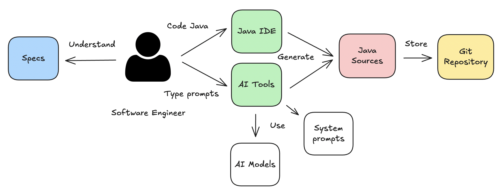
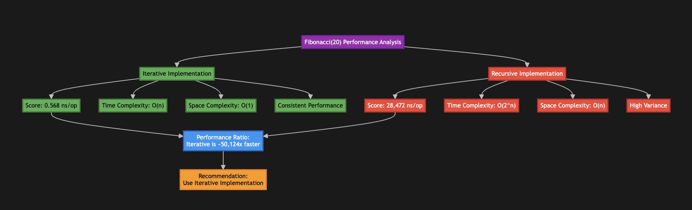
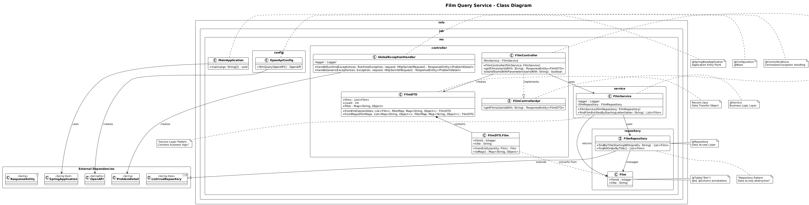
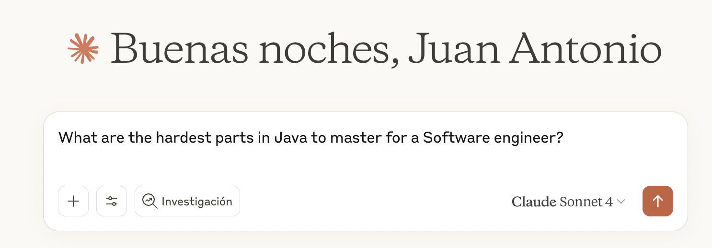

# What's new in Cursor rules for Java 0.10.0?

## What are Cursor rules for Java?

The project provides a collection of System prompts for Java that help software engineers in their daily programming work.
The [available System prompts for Java](../../CURSOR-RULES-JAVA.md) cover aspects like `Build system based on Maven`, `Design`, `Coding`, `Testing`, `Refactoring & JMH Benchmarking`, `Performance testing with JMeter`, `Profiling with Async profiler/JDK tools` & `Documentation`.



## What is new in this release?

In this release, the project has released several features:

- Improvements in System prompts
  - Added support for JMH Benchmarking
  - Added support for project documentation and UML/C4 diagrams
  - Added support for Java Generics
  - Added support for classic Java Exception handling
- Improvements in the project
  - Added product support for Claude Code, Github Copilot & Jetbrains Junie
  - Use the System prompts in a purist way
  - Rules have been renamed from `.mdc` to `.md` format to increase readability

Let's explain one by one the different features released

### Support for JMH Benchmarking

Sometimes you discover different ways to solve the same problem, but how do you select the best approach? Java provides JMH to solve that issue.

In the repository, the rule `112-java-maven-plugins` was updated to now provide support for adding JMH to repositories without modules in an easy way as a Maven profile.

How to do it?

```bash
Add JMH support using the cursor rule @112-java-maven-plugins and don't ask any questions
```

Once you have JMH support in your Maven build, you can generate JMH benchmarks easily with the following `User prompt`:

```bash
Can you create a JMH benchmark in order to know what is the best implementation?
```

**Note:** Add in the context the class/classes to measure

Once you have the JMH Benchmark, you can generate generate the JSON report in the following way:

```bash
./mvnw clean package -Pjmh
java -cp target/jmh-benchmarks.jar info.jab.demo.benchmarks.FibonacciBenchmark
```

With the report generated in JSON format, you can analyze them with the following `User prompt`:

```bash
Can you explain the JMH results and advise about the best implementation?
```

This kind of analysis can help the team to take decissions about what alternative is better to maintain in the repository.



Further information about JMH:

- https://github.com/openjdk/jmh
- https://jmh.morethan.io/

### Support for project documentation and UML/C4 diagrams

Maybe you're the only one who always schedules documentation activities at the end of the sprint when you feel tired and not particularly inspired, but you know it's something necessary.

To help you, you can use the following rule:

```
Generate technical documentation & diagrams about the project with the cursor rule @170-java-documentation
```

The rule supports:

- Documentation at different levels (README.md, package-info.java & javadocs)
- Diagrams (UML Class diagram, UML Sequence diagram & C4 Model diagrams)



Using `UML Class diagrams`, you can understand better how is currently the implementation and if you can improve in some way the code.

Further information about documentation & diagrams:

- https://docs.oracle.com/javase/specs/jls/se7/html/jls-7.html
- https://en.wikipedia.org/wiki/Class_diagram
- https://c4model.com/

## Added support for Java Generics

Java Generics is not an easy feature in Java, indeed if you interact with [Claude](https://claude.ai/new) and you ask the the question:



```bash
What are the hardest parts in Java to master for a Software engineer?
```

`Java Generics` always appears, so... in this release, the project has added a new system prompt to cover this Gap. Now, you can create the following interactive user prompt:

```bash
Review my code to show several alternatives to apply Java Generics with the cursor rule @128-java-generics
```

or the non-interactive approach:

```bash
Improve the solution applying the system prompt @127-java-exception-handling without any question
```

The rule covers multiple cases and it was reviewed with Generics implementations from popular Java projects like: `Micrometer`, `Kafka` & `azure-sdk-for-java`

Further information about Java Generics:

- https://docs.oracle.com/javase/tutorial/java/generics/index.html
- https://dev.java/learn/generics/

### Added support for classic Java Exception handling

In the previous release 0.9.0, the project released the rule: `@143-java-functional-exception-handling`, but what happened with developments which don't use functional programming? To solve this gap, this release added the rule: `@127-java-exception-handling`

Now you can review the current implementation and refactor the code to improve exception handling in a classic way with:

```bash
Review my code to show several alternatives to apply Java Exception handling with the cursor rule @127-java-exception-handling
```

Further information about Java Exceptions:

- https://dev.java/learn/exceptions/

### Added product support for Claude Code, Github Copilot & Jetbrains Junie

This project was originally designed for Cursor (SOTA) in the niche of AI tools, but the Java market is broader and doing some tests in other environments, I discovered that this project could be used in other environments such as:

- Cursor
- Cursor CLI
- JetBrains IntelliJ IDEA + Cursor CLI
- Claude Code CLI
- JetBrains IntelliJ IDEA + Claude Code CLI
- GitHub Copilot (Free tier)
- JetBrains IntelliJ IDEA + JetBrains Junie

If you are interested, you can take a look at the latest review:
https://github.com/jabrena/cursor-rules-java/blob/main/docs/reviews/review-20250829.md

### Use the System prompts in a purist way

Normally, when you try to solve a software problem, the solution can be implemented in different ways. This is the reason that several cursor rules have an interactive way, but in some scenarios the software engineer might prefer to delegate the action directly to the model at the risk that the implemented solution doesn't match their programming style.

From this release, the rules provide examples of using Cursor rules and system prompts in a purist way.

**Example 1:**

```bash
Add VAVR dependency with the help of @111-java-maven-dependencies and don't ask any questions
```

**Example 2:**

```bash
Add Maven Enforcer plugin only from the rule @112-java-maven-plugins without any question
Apply Java Generics in the class with @128-java-generics without any question
```

**Example 3:**

```bash
Add tests for the following classes with  @131-java-unit-testing
Create a UML class diagram with @170-java-documentation without any question
```

More examples [here](https://github.com/jabrena/cursor-rules-java/blob/main/CURSOR-RULES-JAVA.md).

### Improve readability in system prompts

After running a `spike` to review if it's possible to rename the original Cursor rules from `.mdc` file extension to the classic Markdown extension `.md`, the results were satisfactory, so now all system prompts have been renamed.

Now, everyone can read the files easily on `GitHub`:
https://github.com/jabrena/cursor-rules-java/tree/main/.cursor/rules

## Do you continue with doubts about the project?

Next Tuesday 7th of October of 2025 you could attend the talk about this projects and solve your doubts: https://devoxx.be/app/talk/4715/the-power-of-cursor-rules-in-java-enterprise-development

## Previous articles

- [What's new in Cursor rules for Java 0.9.0?](0.9.0.md)
