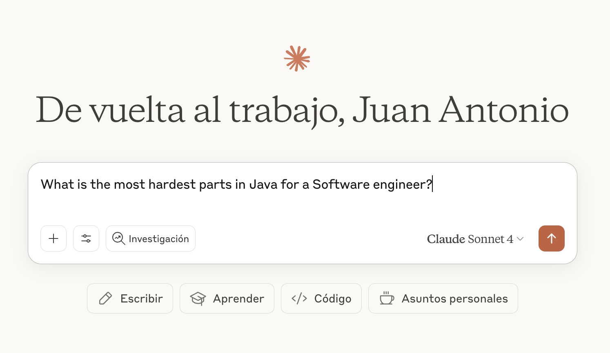

# What is new in Cursor rules for Java 0.10.0?

In this release, the project has added few things that Developers has issues or they are "boring" like:

- Run Java benchmarks with JMH with support for latest Java versions
- Add support for Documentation in Java projects and Diagrams in different ways
- Add support for Java Generics
- Add support for Classic Exception Handling to be refactored later for modern approaches like Functional exception handling

Lets explain one by one the features releases and the new expanded support outside of Cursor.

## Improvements in System prompts

### Support for JMH Benchmarking

Sometimes you discover different ways to solve the same problem but how to select the best approach? Java provides JMH to solve that issue.

In the repository, it was updated the rule `112-java-maven-plugins` which now provide support to add in repositories without modules JMH in an easy way as a maven profile.

How to do it?

```bash
Improve the pom.xml using the cursor rule @112-java-maven-plugins
```

or the quick way:

```bash
Add JMH support using the cursor rule @112-java-maven-plugins and not make any question
```

Once you have JMH support in your Maven project, now you could generate JMH Benchmarks in an easy way with:

```bash
Can you create a JMH benchmark in order to know what is the best implementation?
```

Once you execute your benchmarks with:

```bash
./mvnw clean package -Pjmh
java -cp target/jmh-benchmarks.jar info.jab.demo.benchmarks.FibonacciBenchmark -wi 1 -i 1 -f 1
```

Once you generate the results in JSON format you can analyze with:

```bash
an you explain the JMH results and advice about the best implementation?
```

You could see some kind of visualization like this:


### Generate documentation & Diagrams

Maybe you are the unique that the Sprint finish that always schedule the documentation activities at the end of the Sprint when you feel tired and not specially inspired but you know that is something necessary.

In order to help you, you could use the following rule:

```
Generate technical documentation & diagrams about the project with the cursor rule @170-java-documentation
```

The rule supports:

- Documentation (README.md, package-info.java & javadocs)
- Diagrams (UML Class diagram, UML Sequence diagram & C4 Model diagrams)

## Java Generics is not your final boss anymore

If you interact with Claude, you make the following question:



```bash
What is the most hardest parts in Java for a Software engineer?
```

Always appear the concept about `Java Generics`, but how to help you? with this motivation in mind, this release add a new rule to cover Generics. Now, you can create the following interactive user prompt:

```bash
Review my code to show several alternatives to apply Java Generics with the cursor rule @128-java-generics
```

or the non interactive approach:

```bash
Improve the solution applying the system prompt @127-java-exception-handling without any question
```

The rule cover the following cases:

- Example 1: Avoid Raw Types
- Example 2: Apply PECS Principle
- Example 3: Use Bounded Type Parameters
- Example 4: Design Effective Generic Methods
- Example 5: Use Diamond Operator for Type Inference
- Example 6: Understand Type Erasure Implications
- Example 7: Handle Generic Inheritance Correctly
- Example 8: Combine Generics with Modern Java Features
- Example 9: Prevent Heap Pollution with @SafeVarargs
- Example 10: Use Helper Methods for Wildcard Capture
- Example 11: Apply Self-Bounded Generics for Fluent Builders
- Example 12: Design APIs with Proper Wildcards
- Example 13: Avoid Arrays Covariance Pitfalls
- Example 14: Serialize Collections with Type Tokens
- Example 15: Eliminate Unchecked Warnings
- Example 16: Use Typesafe Heterogeneous Containers

### Java Exceptions should not be the rule exception

In the previous releasea 0.9.0, the project released the rule: `@143-java-functional-exception-handling` but what happend with the developments which doesn´t use Functional programming in Small? To solve this gap, in this release, it was add the rule: `@127-java-exception-handling`

Now you can review current implementation and refactor the code and improve the exception handling in a classic way with:

```bash
Review my code to show several alternatives to apply Java Exception handling with the cursor rule @127-java-exception-handling
```

## Improvements in the project

Enjoy

Juan Antonio
