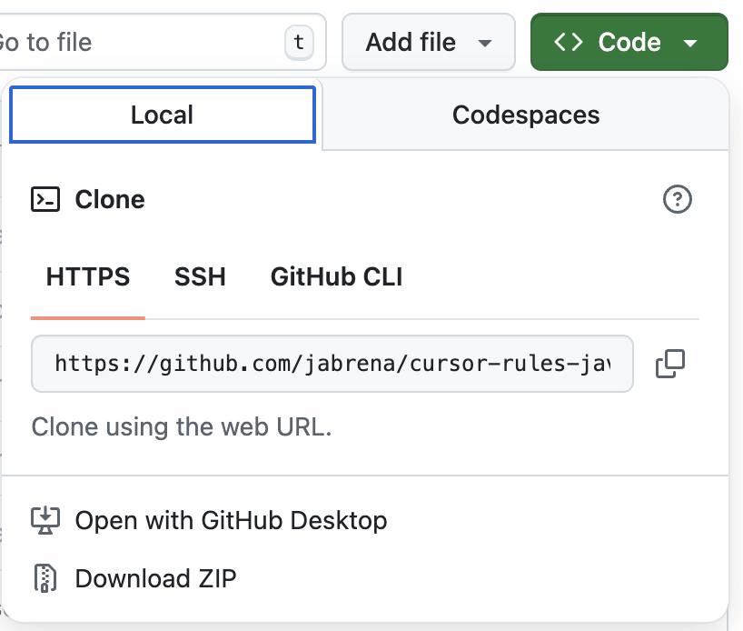
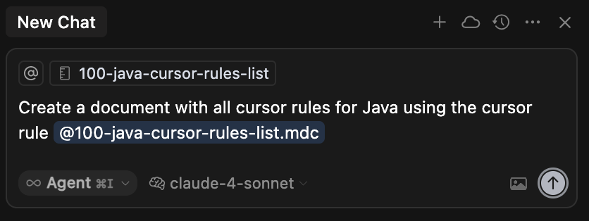

# Getting started for System prompts for Java

If you are interested in getting the benefits of these `System prompts for Java`, read this document.

## Concepts related to this project

### What is a System prompt?

A system prompt is a set of instructions given to an AI model that defines how it should behave, what role it should take on, and what guidelines it should follow when responding to users. Think of it as the "operating manual" that shapes the AI's personality, capabilities, and boundaries.


### Types of System prompts

The repository provides System prompts that can behave interactively or non-interactively, depending on how the user employs them.

- **System prompts:** `Create a UML class diagram with @170-java-documentation without asking questions` or `Add the Maven Enforcer plugin using the rule @112-java-maven-plugins without asking questions`
- **Interactive System Prompts:** Prompts that ask questions and include conditional logic. Examples: `Improve the pom.xml using the cursor rule @112-java-maven-plugins` or `Generate technical documentation and diagrams about the project with the cursor rule @170-java-documentation`

### Types of customized behaviours for system prompts

- **Consultative Interactive:** Prompts that suggest alternatives to improve software development. Examples: `Improve the class/classes added in the context applying the system prompt @128-java-generics with the behaviour @behaviour-consultative-interaction` or `Improve the class/classes added in the context applying the system prompt @131-java-testing-unit-testing with the behaviour @behaviour-consultative-interaction`
- **Progressive Learning:** Using the system prompts, you can generate courses about a particular topic to better understand the changes generated by models. Example: `Create a course about @128-java-generics.md using the behavior @behaviour-progressive-learning.md and place the course in @courses`

## How to install the System prompts?

### Using the Git repository

This view has a big green button with the text: `<> Code`. If you click on it, you will see the tab `Local` and you will see the link for: `Download Zip`.



Once you have downloaded it, go to the `Downloads` folder in your system and you should see the zip file: `cursor-rules-java-main.zip`. Unzip it and copy the folder `.cursor` into the Java repository where you want to use these Cursor rules.

**Note:** ⚠️ Using this approach, you are using the main branch which is not released yet.

### Using the latest tagged zipped rules

Downloading the zipped release is the safest approach if you are interested in using the latest well-tested release. Go to [the latest release](https://github.com/jabrena/plinth/releases) and download the zip assets included in the latest release. As in the previous case, download the zip, unzip it and copy the folder `.cursor` into the Java repository where you want to use these Cursor rules.

### Using a JBang CLI program specialized in this task

**JBang** is a tool that lets you run Java code as scripts without the need for traditional project setup, compilation, or build tools - just write Java and run it directly.

Using JBang, you can delegate the action to put the `.cursor/rules` from this repository into the Java repository where you want to use these Cursor rules.

Execute the following commands to use it:

```bash
sdk install jbang
# Add System Prompts for Java in .cursor/rules
jbang --fresh setup@jabrena init --cursor https://github.com/jabrena/plinth
```

## Using your first System prompt in your Java repository

| Cursor Rule | Description | Prompt | Notes |
|-------------|-------------|--------|-------|
| [000-system-prompt-list](../../.cursor/rules/000-system-prompt-list.md) | Generate list of System Prompts for Java | `Create a document with all System prompts for Java using @000-system-prompt-list` | This cursor rule is applied automatically without any interaction with the software engineer. |

Once you have installed the cursor rules in the path `.cursor/rules`, type the following prompt in the cursor chat:



```bash
Create a document with all System prompts for Java using @000-system-prompt-list
```

**Note:** ⚠️ Drag and drop the file @000-system-prompt-list into the chat area to apply the cursor rule.

## Do you want to learn more?

For a full understanding of this project, follow [jabrena/plinth](https://github.com/jabrena/plinth).
