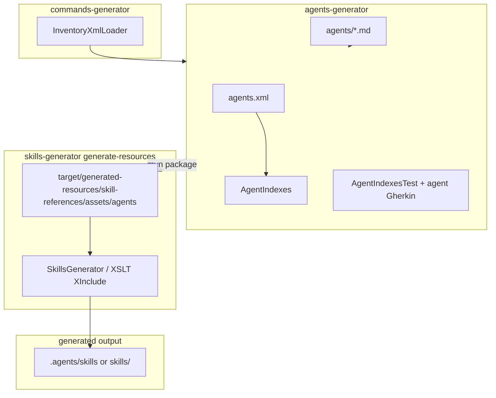

## Context

Issue [#1036](https://github.com/jabrena/plinth/issues/1036) extracts agent ownership from `skills-generator` into `agents-generator`. Today:

- Nine embedded robot agents live under `skills-generator/src/main/resources/skill-references/assets/agents/`.
- `java-agents-inventory-template.md` defines the inventory table consumed by skill `002-agents-inventory`.
- `005-agents-installation.xml` embeds all nine agent definitions through XInclude and is the installer contract for `.cursor/agents`, `.claude/agents`, `.codex/agents`, and `.github/agents`.
- `SkillsGeneratorTest.EmbeddedAgentBundleTests` validates installer/inventory parity, tech-lead routing, coder skill precedence, framework JDBC preferences, and the nine-agent bundle; it contains `//TODO Move to agents-generator ASAP`.
- Skills `002-agents-inventory` and `005-agents-installation` embed agent content through XInclude at build time.
- Agents must not invoke Maven at runtime; generated skills under `.agents/skills/` or `skills/` are the runtime artifact.
- `commands-generator` ([#1035](https://github.com/jabrena/plinth/issues/1035)) already owns `InventoryXmlLoader` and provides the reference extraction pattern.

Phase 1 previously merged generators to remove cross-generator coupling. This change reintroduces deliberate one-way dependencies: `agents-generator` -> `commands-generator` and `skills-generator` -> `agents-generator`.

## Goals / Non-Goals

**Goals:**

- Own agent inventory manifest, assets, loader, and agent-focused tests in `agents-generator`.
- Preserve agent bundle and delegation behavior required by `analysis-design-agents`.
- Bridge agent assets into `skills-generator` during `generate-resources`.
- Prove agent-to-skill propagation through automated tests and updated Gherkin acceptance coverage.
- Document contributor commands for isolated and integrated builds.

**Non-Goals:**

- Design a PML agent schema ([#993](https://github.com/jabrena/plinth/issues/993)).
- Add, remove, or change agent delegation contracts or agent roles.
- Move skill `200-agents-md` sources or AGENTS.md generation templates into `agents-generator`.
- Make skills invoke `./mvnw` at agent runtime.
- Promote public `skills/` release output unless explicitly requested.

## Two-Step Change Strategy

### Step 1: Behavior-preserving extraction

Create `agents-generator`, introduce `agents.xml` and `AgentIndexes.java`, relocate agent sources and agent-owned tests, wire one-way dependencies, and stage bridged assets into `skills-generator` without changing agent contracts or generated skill semantics.

Validation after Step 1:

- `./mvnw clean verify -pl agents-generator`
- `./mvnw clean install -pl skills-generator -am`
- `./mvnw clean verify`
- Generated `.agents/skills/002-agents-inventory` and `.agents/skills/005-agents-installation` match pre-extraction behavior for embedded agent content.

### Step 2: Inventory template hardening (same change if low risk)

Generate `java-agents-inventory-template.md` from `agents.xml` during the bridge step so `002-agents-inventory` cannot drift from the agent manifest.

Validation after Step 2:

- Removing or renaming an agent in `agents.xml` without updating generated template output fails `agents-generator` or bridge parity tests.
- `002` generated reference still lists exactly the manifest agents.

If Step 2 increases move risk, ship Step 1 first and follow immediately with template generation in the same PR only when parity tests are already green.

## Recommended Architecture

```text
commands-generator (shared XML helper owner)
└── InventoryXmlLoader.java

agents-generator (source of truth)
├── depends on commands-generator
├── src/main/resources/agents.xml
├── src/main/resources/agents/*.md
├── src/main/resources/java-agents-inventory-template.md
├── src/main/java/info/jab/pml/AgentIndexes.java
└── src/test/java + gherkin/agents/

skills-generator (consumer + skill owner)
├── depends on agents-generator (and commands-generator transitively or directly)
├── generate-resources bridge
│   └── copy/unpack → target/generated-resources/.../skill-references/assets/agents/
├── skill-references/002-agents-inventory.xml   (unchanged XInclude paths)
├── skill-references/005-agents-installation.xml (unchanged XInclude paths)
└── tests: bridge parity + skill propagation
```



## Decisions

### Module naming and coordinates

Use directory and artifact id `agents-generator` with `groupId` `info.jab.pml`, matching the `commands-generator` and `skills-generator` pattern.

### `agents-generator` is the source of truth

`agents-generator` owns `agents.xml`, `agents/*.md`, `AgentIndexes.java`, `java-agents-inventory-template.md`, agent contract tests, and agent Gherkin features.

Agent assets move from `skill-references/assets/agents/` to `src/main/resources/agents/`.

Alternative considered: keep sources in `skills-generator` and only add a thin wrapper module. Rejected because it preserves the ownership problem the issue is solving.

### Introduce `agents.xml` manifest

Unlike the pre-extraction agent bundle, which relied on installer XIncludes and a hand-maintained inventory template, `agents-generator` introduces `agents.xml` registering the nine embedded agents in installation order (matching `005-agents-installation.xml`).

Alternative considered: keep inventory-only without a manifest. Rejected because `commands-generator` already established manifest-driven parity tests and drift prevention.

### Bridge at `skills-generator` `generate-resources`

`skills-generator` declares a Maven dependency on `agents-generator` and, during `generate-resources`:

1. Copies or unpacks `agents/*.md` and `java-agents-inventory-template.md` from `agents-generator` into `target/generated-resources/`.
2. Exposes staged files at `skill-references/assets/agents/` and `skill-references/assets/java-agents-inventory-template.md` on the main classpath.
3. Optionally generates inventory rows from `agents.xml` before skill generation.

Implementation preference: mirror the sibling-module copy pattern used by `commands-generator` bridge (`maven-resources-plugin:copy-resources`), followed by test classpath staging so `SkillReferenceGenerator` continues resolving existing XInclude paths without XML edits.

Alternative considered: point XIncludes directly at dependency JAR paths. Rejected for the first iteration because it changes `SkillReferenceGenerator` base URIs and complicates local IDE resolution.

Alternative considered: runtime classpath lookup from agents. Rejected because skills must remain self-contained generated artifacts.

### One-way dependencies only

- `agents-generator` depends on `commands-generator` (reuse `InventoryXmlLoader`).
- `skills-generator` depends on `agents-generator`.
- Neither upstream module depends on `skills-generator`.

Do not duplicate `InventoryXmlLoader`. Do not add a separate shared-library module.

### Split validation responsibilities

`EmbeddedAgentBundleTests` currently spans agent ownership and skill-installer ownership. Split as follows:

| Concern | Module | Examples |
|--------|--------|----------|
| Manifest integrity, asset presence, per-agent contracts | `agents-generator` | `agents.xml` order, tech-lead routing, coder skill precedence |
| Installer XInclude parity with manifest | `skills-generator` | `005-agents-installation.xml` includes exactly manifest files |
| Bridge staging correctness | `skills-generator` | staged assets match `AgentIndexes.agentFiles()` |
| Generated skill propagation | `skills-generator` | `002` / `005` references embed staged agent bodies |

The installer parity test must remain in `skills-generator` because `005-agents-installation.xml` stays there. It should call `AgentIndexes.agentFiles()` from the dependency instead of duplicating manifest parsing.

### Runtime installer path in the Plinth repo

For `005-agents-installation`, update the repository copy source path to `agents-generator/src/main/resources/agents/`. For skill-only installs from `skills/`, embedded reference content remains the fallback.

### Generated-resources must not be committed

Bridged agent assets under `skills-generator` source tree are removed after the bridge works. Only `target/generated-resources/` (or equivalent) holds staged copies during build. This prevents dual ownership from returning.

### Skill `200-agents-md` stays in skills-generator

`200-agents-md` generates repository `AGENTS.md` through interactive templates and is not part of the embedded nine-agent bundle. Its sources remain in `skills-generator`.

## Component Boundaries

| Component | Owns | Consumes |
|-----------|------|----------|
| `commands-generator` | `InventoryXmlLoader`, command bundle | parent POM only |
| `agents-generator` | `agents.xml`, `agents/*.md`, loaders, agent tests | `commands-generator` |
| `skills-generator` bridge | generated `skill-references/assets/agents/` staging | `agents-generator` JAR |
| `skills-generator` skills | `002` / `005` XML, installer wording, skill Gherkin | staged agent assets |
| Agents at runtime | generated `.agents/skills` or `skills/` | not Maven modules |

## Data Flow

1. Contributor edits `agents-generator/src/main/resources/agents/*.md` or `agents.xml`.
2. `./mvnw clean verify -pl agents-generator` validates manifest, assets, and contracts.
3. `./mvnw clean install -pl skills-generator -am` rebuilds `agents-generator`, stages assets for XInclude, runs skill generation tests, copies output to `.agents/skills/`.
4. Skill `005` may copy from `agents-generator/.../agents/` when run inside the Plinth repo; otherwise it uses embedded reference markdown.

## Failure Handling

| Failure | Expected behavior |
|---------|-------------------|
| Missing agent asset for manifest entry | `agents-generator` tests fail |
| `005` XInclude list diverges from manifest | `skills-generator` installer parity test fails |
| Bridge not run or stale JAR used | skill propagation / bridge tests fail; docs require `-am` |
| Contributor runs `-pl skills-generator` without `-am` after agent edits | may use stale `~/.m2` artifact; document and optionally add reactor-order note in failure message |
| `InventoryXmlLoader` not reachable from `agents-generator` | `agents-generator` compile failure until dependency is wired |

## Testing Strategy

**Unit / focused tests (`agents-generator`)**

- Manifest load order and uniqueness
- Every `agents.xml` entry has `agents/<file>`
- Per-agent contract assertions currently in `EmbeddedAgentBundleTests`
- Relocated agent Gherkin features and prompt inventory paths

**Integration tests (`skills-generator`)**

- `AgentBridgeTest`: staged `skill-references/assets/agents/` matches `AgentIndexes.agentFiles()`
- `AgentInstallerParityTest`: `005-agents-installation.xml` XIncludes match manifest
- `AgentSkillPropagationTest` (or `SkillsGeneratorTest` extension): generated `002` / `005` references contain markers from staged assets; fails if staging breaks

**Acceptance / Gherkin**

- Update `002-agents-inventory.feature` and `005-agents-installation.feature` to assert generated skill content and `agents-generator` source paths
- Keep agent command-Gherkin under `agents-generator`; skill Gherkin under `skills-generator`

**Verification commands**

```bash
./mvnw clean verify -pl agents-generator
./mvnw clean install -pl skills-generator -am
./mvnw clean verify
```

## Compatibility Review

- No change to public agent names, routing tables, or delegation contracts in agent markdown.
- No change to installed `.cursor/agents/` file names.
- `analysis-design-agents` bundle and delegation requirements remain satisfied; only source ownership moves.
- Phase 1 "no generator coupling" principle is preserved as directed dependencies, not cycles.
- Mirrors the completed `commands-generator` ([#1035](https://github.com/jabrena/plinth/issues/1035)) extraction pattern.

## Risks / Trade-offs

- [Risk] Stale agent assets if contributors omit `-am`. -> Document in `AGENTS.md` / `DEVELOPER.md`; bridge tests catch most drift.
- [Risk] Inventory template drift from `agents.xml`. -> Step 2 template generation.
- [Risk] Splitting `EmbeddedAgentBundleTests` incompletely leaves blind spots. -> Explicit test matrix above.
- [Risk] Generated-resources classpath ordering breaks XInclude. -> Add bridge test before relying on skill generation.
- [Risk] Overlap with `commands-generator` bridge logic. -> Reuse the same staging pattern; keep bridges independent per bundle.

## Migration Plan

1. Create `agents-generator` module and register it in root `pom.xml`.
2. Introduce `agents.xml` and `AgentIndexes.java`; move agent assets, inventory template, agent-owned tests, and agent Gherkin.
3. Add `agents-generator` dependency on `commands-generator`; add `skills-generator` dependency on `agents-generator`.
4. Add dependency and `generate-resources` bridge; remove committed duplicate assets from `skills-generator`.
5. Split tests and add propagation coverage.
6. Update skill XML copy-path guidance, skill Gherkin, docs.
7. Run full verification and `openspec validate --all`.

## ADR Candidates

| Topic | Recommendation |
|-------|----------------|
| Generator module extraction pattern | One directed Maven module per embeddable bundle (commands completed, agents now) |
| Build bridge vs runtime lookup | Always bridge at `generate-resources`; agents consume generated skills only |
| Cross-module XML helper sharing | Reuse `InventoryXmlLoader` from `commands-generator`; no shared-library module |
| Agent manifest introduction | Add `agents.xml` in the same change to match commands parity model |

## Resolved Design Questions

- **Artifact id**: `agents-generator`
- **Agent asset path in new module**: `src/main/resources/agents/`
- **Staging target in consumer**: generated `skill-references/assets/agents/`
- **`InventoryXmlLoader`**: reuse from `commands-generator` via dependency
- **Inventory template**: generate in Step 2 of the same change when parity tests are already green
- **`200-agents-md`**: remains in `skills-generator`

## Open Questions

None blocking implementation. Step 2 template auto-generation timing remains an implementation convenience decision inside the approved two-step strategy.
