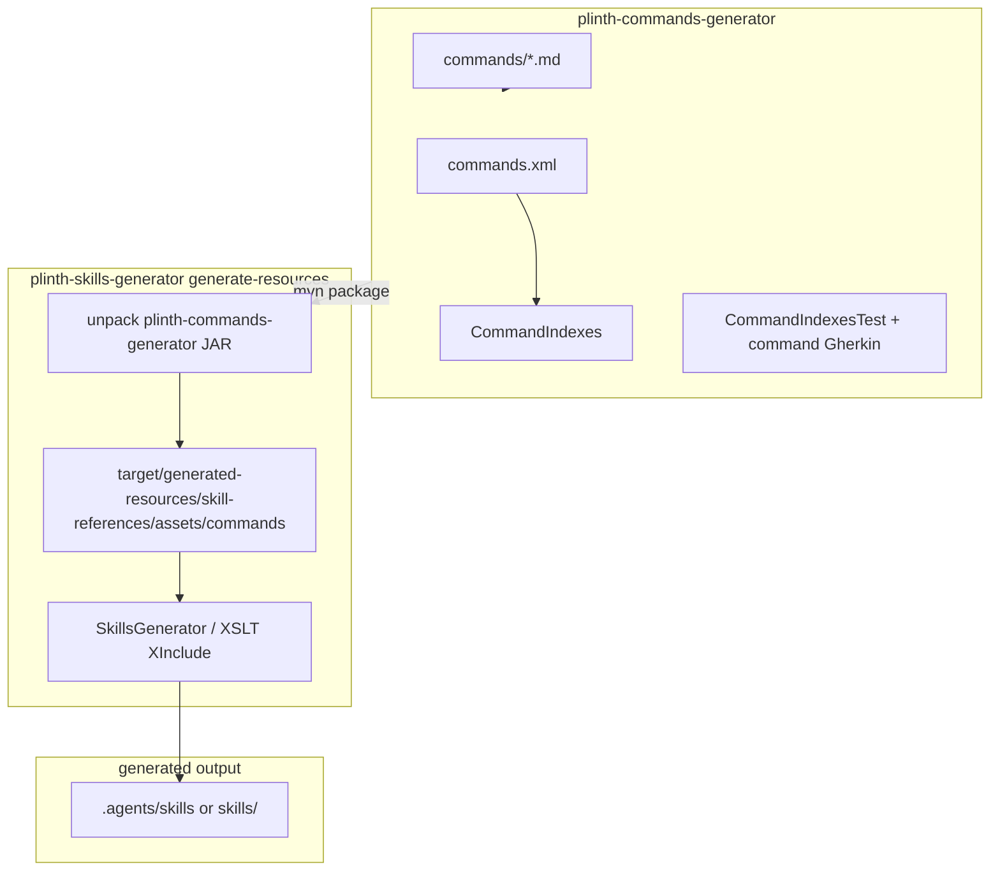

## Context

Issue [#1035](https://github.com/jabrena/plinth/issues/1035) extracts command ownership from `plinth-skills-generator` into `plinth-commands-generator`. Today:

- `commands.xml` registers 11 embedded commands in installation order.
- `CommandIndexes.java` loads the inventory from `commands.xml`.
- Command markdown assets live under `plinth-skills-generator/src/main/resources/skill-references/assets/commands/`.
- `CommandIndexesTest` enforces parity between inventory, installer XIncludes, inventory template rows, and per-command routing contracts; it contains `//TODO Move to plinth-commands-generator ASAP`.
- Skills `001-commands-inventory` and `004-commands-installation` embed command content through XInclude at build time.
- Agents must not invoke Maven at runtime; generated skills under `.agents/skills/` or `skills/` are the runtime artifact.

Phase 1 previously merged generators to remove cross-generator coupling. This change reintroduces a deliberate one-way dependency: `plinth-skills-generator` → `plinth-commands-generator`.

## Goals / Non-Goals

**Goals:**

- Own command inventory, assets, loader, and command-focused tests in `plinth-commands-generator`.
- Preserve command bundle behavior required by `analysis-design-commands`.
- Bridge command assets into `plinth-skills-generator` during `generate-resources`.
- Prove command-to-skill propagation through automated tests and updated Gherkin acceptance coverage.
- Document contributor commands for isolated and integrated builds.

**Non-Goals:**

- Design the PML command schema ([#993](https://github.com/jabrena/plinth/issues/993)).
- Extract agents into `plinth-agents-generator` ([#1036](https://github.com/jabrena/plinth/issues/1036)).
- Add, remove, or change command contracts.
- Make skills invoke `./mvnw` at agent runtime.
- Promote public `skills/` release output unless explicitly requested.

## Two-Step Change Strategy

### Step 1: Behavior-preserving extraction

Create `plinth-commands-generator`, relocate command sources and command-owned tests, wire the one-way dependency, and stage bridged assets into `plinth-skills-generator` without changing command contracts or generated skill semantics.

Validation after Step 1:

- `./mvnw clean verify -pl plinth-commands-generator`
- `./mvnw clean verify -pl plinth-skills-generator -am`
- `./mvnw clean verify`
- Generated `.agents/skills/001-commands-inventory` and `.agents/skills/004-commands-installation` match pre-extraction behavior for embedded command content.

### Step 2: Inventory template hardening (same change if low risk)

Generate `java-commands-inventory-template.md` from `commands.xml` during the bridge step so `001-commands-inventory` cannot drift from the command manifest.

Validation after Step 2:

- Removing or renaming a command in `commands.xml` without updating generated template output fails `plinth-commands-generator` or bridge parity tests.
- `001` generated reference still lists exactly the manifest commands.

If Step 2 increases move risk, ship Step 1 first and follow immediately with template generation in the same PR only when parity tests are already green.

## Recommended Architecture

```text
plinth-commands-generator (source of truth)
├── src/main/resources/commands.xml
├── src/main/resources/commands/*.md
├── src/main/java/info/jab/pml/CommandIndexes.java
├── src/main/java/info/jab/pml/InventoryXmlLoader.java
└── src/test/java + gherkin/commands/

plinth-skills-generator (consumer + skill owner)
├── depends on plinth-commands-generator (compile)
├── generate-resources bridge
│   └── unpack JAR resources → target/generated-resources/.../skill-references/assets/commands/
├── skill-references/001-commands-inventory.xml   (unchanged XInclude paths)
├── skill-references/004-commands-installation.xml (unchanged XInclude paths)
└── tests: bridge parity + skill propagation
```



## Decisions

### Module naming and coordinates

Use directory and artifact id `plinth-commands-generator` with `groupId` `info.jab.pml`, matching the `plinth-skills-generator` pattern and the simpler `markdown-validator` module naming style.

Alternative considered: `cursor-rules-java-plinth-commands-generator`. Rejected as unnecessarily long for a reactor module contributors invoke with `-pl`.

### `plinth-commands-generator` is the source of truth

`plinth-commands-generator` owns `commands.xml`, `commands/*.md`, `CommandIndexes.java`, command contract tests, and command Gherkin features.

Command assets move from `skill-references/assets/commands/` to `src/main/resources/commands/`.

Alternative considered: keep sources in `plinth-skills-generator` and only add a thin wrapper module. Rejected because it preserves the ownership problem the issue is solving.

### Bridge at `plinth-skills-generator` `generate-resources`

`plinth-skills-generator` declares a Maven dependency on `plinth-commands-generator` and, during `generate-resources`:

1. Unpacks `commands/*.md` and optional `commands.xml` from the `plinth-commands-generator` artifact into `target/generated-resources/`.
2. Copies unpacked command files into `skill-references/assets/commands/` under generated resources added to the main classpath.
3. Optionally generates `java-commands-inventory-template.md` into the same generated-resources tree before skill generation.

Implementation preference: `maven-dependency-plugin:unpack-dependencies` scoped to `info.jab.pml:plinth-commands-generator`, followed by `maven-resources-plugin:copy-resources` or `build-helper-maven-plugin:add-resource` so tests and `SkillReferenceGenerator` continue resolving `skill-references/assets/commands/*` without XML edits.

Alternative considered: point XIncludes directly at dependency JAR paths. Rejected for the first iteration because it changes `SkillReferenceGenerator` base URIs and complicates local IDE resolution.

Alternative considered: runtime classpath lookup from agents. Rejected because skills must remain self-contained generated artifacts.

### One-way dependency only

`plinth-skills-generator` depends on `plinth-commands-generator`. `plinth-commands-generator` does not depend on `plinth-skills-generator`.

### Move `InventoryXmlLoader` to `plinth-commands-generator`

Move `InventoryXmlLoader` into `plinth-commands-generator` with `CommandIndexes` and make it `public` so `SkillIndexes` and `SkillTriggerInventoryTest` reuse it through the module dependency.

Do not duplicate the class. Do not add a separate shared-library module.

### Split validation responsibilities

`CommandIndexesTest` currently spans command ownership and skill-installer ownership. Split as follows:

| Concern | Module | Examples |
|--------|--------|----------|
| Manifest integrity, asset presence, per-command contracts | `plinth-commands-generator` | `commands.xml` order, `commands/update-issue.md` routing |
| Installer XInclude parity with manifest | `plinth-skills-generator` | `004-commands-installation.xml` includes exactly manifest files |
| Bridge staging correctness | `plinth-skills-generator` | staged assets match `CommandIndexes.commandFiles()` |
| Generated skill propagation | `plinth-skills-generator` | `001` / `004` references embed staged command bodies |

The installer parity test must remain in `plinth-skills-generator` because `004-commands-installation.xml` stays there. It should call `CommandIndexes.commandFiles()` from the dependency instead of duplicating manifest parsing.

### Runtime installer path in the Plinth repo

For `004-commands-installation`, update the repository copy source path to `plinth-commands-generator/src/main/resources/commands/`. For skill-only installs from `skills/`, embedded reference content remains the fallback.

### Generated-resources must not be committed

Bridged command assets under `plinth-skills-generator` source tree are removed after the bridge works. Only `target/generated-resources/` (or equivalent) holds staged copies during build. This prevents dual ownership from returning.

## Component Boundaries

| Component | Owns | Consumes |
|-----------|------|----------|
| `plinth-commands-generator` | `commands.xml`, `commands/*.md`, loaders, command tests | parent POM only |
| `plinth-skills-generator` bridge | generated `skill-references/assets/commands/` staging | `plinth-commands-generator` JAR |
| `plinth-skills-generator` skills | `001` / `004` XML, installer wording, skill Gherkin | staged command assets |
| Agents at runtime | generated `.agents/skills` or `skills/` | not Maven modules |

## Data Flow

1. Contributor edits `plinth-commands-generator/src/main/resources/commands/*.md` or `commands.xml`.
2. `./mvnw clean verify -pl plinth-commands-generator` validates manifest, assets, and contracts.
3. `./mvnw clean install -pl plinth-skills-generator -am` rebuilds `plinth-commands-generator`, unpacks assets, stages them for XInclude, runs skill generation tests, copies output to `.agents/skills/`.
4. Skill `004` may copy from `plinth-commands-generator/.../commands/` when run inside the Plinth repo; otherwise it uses embedded reference markdown.

## Failure Handling

| Failure | Expected behavior |
|---------|-------------------|
| Missing command asset for manifest entry | `plinth-commands-generator` tests fail |
| `004` XInclude list diverges from manifest | `plinth-skills-generator` installer parity test fails |
| Bridge not run or stale JAR used | skill propagation / bridge tests fail; docs require `-am` |
| Contributor runs `-pl plinth-skills-generator` without `-am` after command edits | may use stale `~/.m2` artifact; document and optionally add reactor-order note in failure message |
| `InventoryXmlLoader` left package-private | `plinth-skills-generator` compile failure until visibility fixed |

## Testing Strategy

**Unit / focused tests (`plinth-commands-generator`)**

- Manifest load order and uniqueness
- Every `commands.xml` entry has `commands/<file>`
- Per-command contract assertions currently in `CommandIndexesTest`
- Relocated command Gherkin features and prompt inventory paths

**Integration tests (`plinth-skills-generator`)**

- `CommandBridgeTest`: staged `skill-references/assets/commands/` matches `CommandIndexes.commandFiles()`
- `CommandInstallerParityTest`: `004-commands-installation.xml` XIncludes match manifest
- `CommandSkillPropagationTest` (or `SkillsGeneratorTest` extension): generated `001` / `004` references contain markers from staged assets; fails if staging breaks

**Acceptance / Gherkin**

- Update `001-commands-inventory.feature` and `004-commands-installation.feature` to assert generated skill content and `plinth-commands-generator` source paths
- Keep command command-Gherkin under `plinth-commands-generator`; skill Gherkin under `plinth-skills-generator`

**Verification commands**

```bash
./mvnw clean verify -pl plinth-commands-generator
./mvnw clean install -pl plinth-skills-generator -am
./mvnw clean verify
```

## Compatibility Review

- No change to public command names, usage strings, or agent routing in command markdown.
- No change to installed `.cursor/commands/` file names.
- `analysis-design-commands` bundle requirements remain satisfied; only source ownership moves.
- Phase 1 “no generator coupling” principle is preserved as a directed dependency, not a cycle.
- Future `plinth-agents-generator` ([#1036](https://github.com/jabrena/plinth/issues/1036)) should mirror this pattern independently.

## Risks / Trade-offs

- [Risk] Stale command assets if contributors omit `-am`. → Document in `AGENTS.md` / `DEVELOPER.md`; bridge tests catch most drift.
- [Risk] Inventory template drift from `commands.xml`. → Step 2 template generation.
- [Risk] Splitting `CommandIndexesTest` incompletely leaves blind spots. → Explicit test matrix above.
- [Risk] Generated-resources classpath ordering breaks XInclude. → Add bridge test before relying on skill generation.
- [Risk] Overlap with `plinth-agents-generator`. → Do not move agent bundle sources in this change.

## Migration Plan

1. Create `plinth-commands-generator` module and register it in root `pom.xml`.
2. Move command inventory, loader, assets, command-owned tests, and command Gherkin.
3. Make `InventoryXmlLoader` public; update `plinth-skills-generator` imports.
4. Add dependency and `generate-resources` bridge; remove committed duplicate assets from `plinth-skills-generator`.
5. Split tests and add propagation coverage.
6. Update skill XML copy-path guidance, skill Gherkin, docs.
7. Run full verification and `openspec validate --all`.

## ADR Candidates

| Topic | Recommendation |
|-------|----------------|
| Generator module extraction pattern | One directed Maven module per embeddable bundle (commands now, agents later) |
| Build bridge vs runtime lookup | Always bridge at `generate-resources`; agents consume generated skills only |
| Cross-module XML helper sharing | Move tiny shared helper with the upstream owner module; no shared-library module |

## Resolved Design Questions

- **Artifact id**: `plinth-commands-generator`
- **Command asset path in new module**: `src/main/resources/commands/`
- **Staging target in consumer**: generated `skill-references/assets/commands/`
- **`InventoryXmlLoader`**: move to `plinth-commands-generator`, reuse via dependency
- **Inventory template**: generate in Step 2 of the same change when parity tests are already green

## Open Questions

None blocking implementation. Step 2 template auto-generation timing remains an implementation convenience decision inside the approved two-step strategy.
