# Problem 1: God Analysis API Implementation Plan

## Requirements Summary
**User Story:** Implement `GET /api/v1/gods/stats/sum` in `examples/requirements-examples/problem1/implementation` aligned with feature scenarios, OpenAPI contract, and ADR constraints.

**Key Business Rules:**
- **Contract source of truth:** OpenAPI (`US-001-god-analysis-api.openapi.yaml`) defines endpoint, params, response, and errors.
- **Input validation:** `filter` must be a single character; `sources` must contain only supported pantheons.
- **Aggregation behavior:** Sum is computed from Unicode-concatenated values of filtered god names and returned as decimal string.
- **Partial results on failures:** Timeout/failure on one source omits that source but still returns `200` with partial aggregation.
- **Architecture constraint:** Servlet-only Spring MVC stack; no reactive dependencies or patterns.

## Approach
Use **London Style (outside-in) TDD**: start with acceptance/API behavior, then service logic, then outbound integrations, with Verify gates after each GREEN slice.

```mermaid
flowchart LR
  subgraph A1[Milestone A1 - API Boundary]
    A[Acceptance RED] --> B[Controller GREEN]
    B --> C[Refactor logging]
    C --> D[Refactor config/errors]
    D --> E[Verify A1]
  end

  subgraph A2[Milestone A2 - Domain Service]
    F[Service tests RED] --> G[Service impl GREEN]
    G --> H[Refactor logging]
    H --> I[Refactor optimize]
    I --> J[Verify A2]
  end

  subgraph A3[Milestone A3 - Outbound Integration]
    K[WireMock IT RED] --> L[Client impl GREEN]
    L --> M[Refactor logging]
    M --> N[Refactor hardening]
    N --> O[Verify A3]
  end

  E --> F
  J --> K
```

## Task List
| # | Task | Phase | TDD | Milestone | Parallel | Status |
|---|------|-------|-----|-----------|----------|--------|
| 1 | Configure `openapi-generator-maven-plugin` and generate API interfaces/DTOs | Setup | | | A1 | TODO |
| 2 | Write failing acceptance tests for happy path and validation errors using Spring `RestClient` | RED | Test | | A1 | TODO |
| 3 | Implement controller, request mapping, enum parsing, and error envelope to satisfy acceptance tests | GREEN | Impl | | A1 | TODO |
| 4 | Add API-layer observability/logging for request validation and failure mapping | Refactor | | | A1 | TODO |
| 5 | Optimize API configuration and exception handling consistency with OpenAPI responses | Refactor | | | A1 | TODO |
| 6 | Verify Milestone A1 (`./mvnw -q test`) and ensure acceptance tests are green | Verify | | milestone | A1 | TODO |
| 7 | Write failing unit tests for Unicode conversion, source parsing, and filter case-sensitivity | RED | Test | | A2 | TODO |
| 8 | Implement aggregation service with immutable flow, `CompletableFuture` parallelization, and `BigInteger` sum | GREEN | Impl | | A2 | TODO |
| 9 | Add service-level observability for source execution and fallback decisions | Refactor | | | A2 | TODO |
| 10 | Optimize service concurrency boundaries and deterministic merge behavior | Refactor | | | A2 | TODO |
| 11 | Verify Milestone A2 (`./mvnw -q test`) with unit + prior API tests green | Verify | | milestone | A2 | TODO |
| 12 | Write failing WireMock integration tests for full-source success and partial-timeout scenarios | RED | Test | | A3 | TODO |
| 13 | Implement outbound client config (`god.outbound.*`) and timeout-tolerant per-source calls | GREEN | Impl | | A3 | TODO |
| 14 | Add outbound-call logging/metrics hooks and interaction verification helpers | Refactor | | | A3 | TODO |
| 15 | Optimize timeout values, stub isolation/reset, and error-translation hardening | Refactor | | | A3 | TODO |
| 16 | Verify Milestone A3 with `./mvnw clean test` and confirm no reactive dependencies introduced | Verify | | milestone | A3 | TODO |

## Execution Instructions
When executing this plan:
1. Complete the current task.
2. **Update the Task List**: set the `Status` for that task (`TODO`, `IN_PROGRESS`, `DONE`, `BLOCKED`).
3. **Update frontmatter `todos`** for the corresponding task id to keep status synchronized.
4. **For GREEN tasks**: MUST complete the associated Verify task before proceeding.
5. **For Verify tasks**: MUST ensure all tests pass and build succeeds before proceeding.
6. **Milestone rows**: complete the pair of Refactor tasks (logging, then optimization/hardening) immediately before each Verify row.
7. Only then proceed to the next task. Never advance without status updates.

**Critical Stability Rules:**
- After every GREEN implementation task, run the verification step for the current milestone.
- All tests must pass before proceeding to the next implementation task.
- If any test fails during verification, fix the issue before advancing.
- Never skip verification steps.
- Keep behavior aligned with OpenAPI + `.feature` scenarios; document conflicts before any requirement changes.

**Parallel column:** `A1`, `A2`, `A3` define delivery slices. Parallel work is allowed only within an active slice if task dependencies permit it.

## File Checklist
| Order | File |
|-------|------|
| 1 | `examples/requirements-examples/problem1/implementation/pom.xml` |
| 2 | `examples/requirements-examples/problem1/implementation/src/main/resources/application.yml` |
| 3 | `examples/requirements-examples/problem1/implementation/src/main/java/info/jab/ms/controller/GodStatsController.java` |
| 4 | `examples/requirements-examples/problem1/implementation/src/main/java/info/jab/ms/controller/GlobalExceptionHandler.java` |
| 5 | `examples/requirements-examples/problem1/implementation/src/main/java/info/jab/ms/service/GodAnalysisService.java` |
| 6 | `examples/requirements-examples/problem1/implementation/src/main/java/info/jab/ms/algorithm/UnicodeAggregator.java` |
| 7 | `examples/requirements-examples/problem1/implementation/src/main/java/info/jab/ms/client/GodDataClient.java` |
| 8 | `examples/requirements-examples/problem1/implementation/src/main/java/info/jab/ms/config/GodOutboundProperties.java` |
| 9 | `examples/requirements-examples/problem1/implementation/src/main/java/info/jab/ms/config/HttpClientConfig.java` |
| 10 | `examples/requirements-examples/problem1/implementation/src/test/java/info/jab/ms/controller/GodAnalysisApiAT.java` |
| 11 | `examples/requirements-examples/problem1/implementation/src/test/java/info/jab/ms/service/GodAnalysisServiceTest.java` |
| 12 | `examples/requirements-examples/problem1/implementation/src/test/java/info/jab/ms/controller/GodAnalysisApiIT.java` |
| 13 | `examples/requirements-examples/problem1/implementation/src/test/java/info/jab/ms/controller/GodAnalysisPartialTimeoutIT.java` |
| 14 | `examples/requirements-examples/problem1/implementation/src/test/resources/mappings/*.json` |
| 15 | `examples/requirements-examples/problem1/implementation/src/test/resources/__files/*` |

## Notes
- Package layout target remains `info.jab.ms` with `controller`, `service`, `client`, `config`, `algorithm`, `dto`, and `exception` packages.
- Canonical source enum values: `greek`, `roman`, `nordic`.
- `GodStatsResponse.sum` remains string-based decimal to avoid numeric overflow concerns.
- First-character filter is exact and case-sensitive by design.
- Out of scope: retries/backoff, new endpoints, and modifications to requirement artifacts unless inconsistency is documented.
