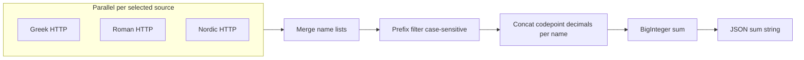

# Implementation plan: US-001 God Analysis API

This document describes how to implement the God Analysis API from the requirements in this folder. It is the canonical implementation plan for Problem 1.

## Overview

Add a standalone Spring Boot application under this directory (e.g. `god-analysis-api/`) that implements `GET /api/v1/gods/stats/sum` with parallel HTTP fetches, 5s timeouts, retries per ADR-002, Unicode-based name aggregation as `BigInteger`, and automated tests (acceptance + integration) aligned with the feature file and OpenAPI.

## Implementation tasks

1. **Scaffold module** — Create standalone Maven project under `examples/requirements-examples/problem1/god-analysis-api/` (Boot 4.0.4, Java 25 or 26), with web, actuator, test dependencies, and WireMock.
2. **Core algorithm** — Unicode decimal concatenation per name, case-sensitive prefix filter, `BigInteger` aggregate; unit tests.
3. **HTTP resilience** — Configurable source URLs; parallel fetches; 5s timeout; 3 retries per source; merge partial results; structured logging of per-source outcomes.
4. **REST controller** — `GET /api/v1/gods/stats/sum` with `filter` + `sources`; JSON `{ "sum" }`; optional validation/OpenAPI.
5. **Automated tests** — `@SpringBootTest` + WireMock: happy path sum, Nordic delay partial result, `filter=N`; tag `acceptance-test` vs `integration-test`.

## Scope and authoritative sources

Treat these as the contract for behavior and testing:

- [US-001_god_analysis_api.feature](US-001_god_analysis_api.feature) — three scenarios: happy path (`sum` exact string), partial result when Nordic times out, `filter=N` yields `"0"`.
- [US-001-god-analysis-api.openapi.yaml](US-001-god-analysis-api.openapi.yaml) — response shape `{ "sum": "<decimal-string>" }`, required query params `filter` (single char) and `sources` (comma-separated).
- [ADR-001-God-Analysis-API-Functional-Requirements.md](ADR-001-God-Analysis-API-Functional-Requirements.md) — monolith, no auth, no cache, direct HTTP.
- [ADR-002-God-Analysis-API-Non-Functional-Requirements.md](ADR-002-God-Analysis-API-Non-Functional-Requirements.md) — parallel calls, **5s timeout per call**, **up to 3 retries per source**, linear spacing between retries, isolated failures, logging/monitoring expectations.

**Note:** [README.md](README.md) contradicts the feature (case sensitivity and conversion); **do not** follow README for implementation—use the feature and OpenAPI instead.

**ADR-002 vs API contract:** ADR-002 asks for “clear indication of which sources contributed.” The OpenAPI and Gherkin only require `sum`. **Approach:** satisfy the public contract first; meet the ADR via **structured logging** (and optional metrics tags) listing successful vs failed/timed-out sources per request. If product later wants this in JSON, extend OpenAPI in a follow-up.

## Runtime stack (reconcile ADR-003 with repo)

[ADR-003-Spring-Boot-Framework-Selection.md](ADR-003-Spring-Boot-Framework-Selection.md) selects **Spring Boot 4.0.4** and **Java 26**. The repo root uses **Java 25** ([pom.xml](../../../pom.xml)). **Recommendation:** use **Spring Boot 4.0.4** with **Java 25** unless you explicitly standardize this example on Java 26—Boot 4 supports Java 17+.

Examples are **not** Maven modules of the root reactor; mirror [examples/spring-boot-demo/implementation/pom.xml](../../spring-boot-demo/implementation/pom.xml) as a **standalone** Maven project (new directory under `examples/requirements-examples/problem1/`, e.g. `god-analysis-api/`).

## Domain algorithm (must match acceptance math)

External APIs return **JSON arrays of strings** (array of god names).

1. **Per source:** GET URL, deserialize to `List<String>` (or stream) of names.
2. **Filter:** include names where the **first Unicode code point** equals the single `filter` code point (**case-sensitive**).
3. **Per-name value:** for each code point in the name, append `Integer.toString(codePoint)` as decimal digits, forming one big decimal string; parse to `BigInteger` (not `long`).
4. **Total:** sum all per-name `BigInteger` values; serialize result with `toString()` for JSON `sum`.

Use `String.codePoints()` (or equivalent) so supplementary characters are handled correctly.

## Configuration

- **Base URLs** for `greek`, `roman`, `nordic` in `application.yml` (defaults matching ADR-001 URLs).
- **Timeout:** 5 seconds per HTTP attempt (connect + read as appropriate for chosen client).
- **Retries:** up to **3** additional attempts per source after failure/timeout (**linear** spacing—e.g. fixed short delay between attempts per ADR-002; no exponential backoff).
- **Parallelism:** fetch selected sources concurrently; **wait** until each source either returns data or exhausts retries (aligns with ADR-002 “completeness priority” before declaring partial aggregate).

Wire Spring configuration via `@ConfigurationProperties` for testability.

## HTTP client and resilience

- Prefer **RestClient** or **WebClient** (Spring 6 / Boot 4 style) with a **shared** builder factory applying timeouts.
- Implement a small **GodListClient** (or per-source callable) that:
  - Runs retries in a loop or via Spring Retry (`@Retryable`) **only if** you can cap attempts at 4 total (1 + 3 retries) and keep **per-source isolation**.
  - On final failure for a source, return **empty list** (or sentinel) so aggregation still returns **HTTP 200** with partial logical result, per feature and OpenAPI.
- **Do not** fail the whole request if one source fails after retries.

## REST layer

- `@RestController` with class-level `@RequestMapping("/api/v1")` and `@GetMapping("/gods/stats/sum")`.
- Bind `filter` (`String` length 1) and `sources` (`String`); parse `sources` to enum or set (`greek`, `roman`, `nordic`).
- Response DTO: `{ "sum": string }` — Jackson serializes `sum` as string; use `BigInteger` internally, expose string in DTO.
- Optional: `springdoc-openapi` + static copy or generation from existing [US-001-god-analysis-api.openapi.yaml](US-001-god-analysis-api.openapi.yaml).
- Optional: `@ControllerAdvice` for **400** on missing/invalid params (OpenAPI reserves 400; feature does not require it—keep validation minimal if you want zero behavior change vs stubs).

## Testing strategy

| Goal | Approach |
|------|----------|
| Happy path / exact `sum` | `@SpringBootTest` + WireMock with **JSON fixture files** copied from live API responses so the computed `sum` equals **`78179288397447443426`**. Avoid live network in CI. |
| Nordic timeout / partial sum | WireMock **fixed delay** on Nordic route **>** 5s (or trigger client timeout); assert `sum` equals aggregate of **Greek + Roman only** (compute expected value from the same stubs). |
| `filter=N` → `"0"` | Same stubs; assert `sum` is `"0"`. |
| Unit tests | Pure tests for conversion + filter + aggregation with small strings. |

Tag tests to mirror Gherkin: e.g. JUnit `@Tag("acceptance-test")` and `@Tag("integration-test")` for Maven `groups`/Surefire filters if desired.

**Gherkin execution:** Optional Cucumber step definitions are **not** required if JUnit tests implement the same assertions; only add Cucumber if you need literal `.feature` execution in CI.

## Deliverables checklist

- New Maven project with `spring-boot-starter-web`, `spring-boot-starter-actuator` (ADR-003), `spring-boot-starter-test`, **WireMock** (or compatible) for tests.
- `README` or `DEVELOPER.md` in the new module: how to run, configure URLs/timeouts, run tests.
- `./mvnw clean verify` from the new module passes.

## Risks and decisions

- **Exact happy-path sum:** Depends on **current** Typicode data; **pin** test data in WireMock JSON so builds are deterministic.
- **Retry + timeout interaction:** Worst-case latency per source is bounded by ADR-002 (~4 attempts × timeout + delays); document this for operators.
- **Java version:** Pick **25 vs 26** explicitly for this example module’s `pom.xml` `java.version`.
