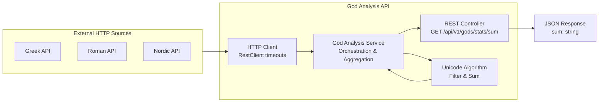
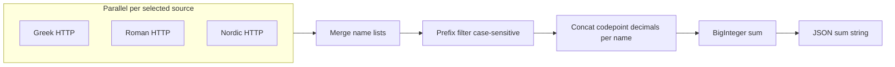

# Problem 1: God Analysis API Implementation Plan

## Requirements Summary

**User Story:** As an API consumer, I want to retrieve aggregated statistical data about god names from multiple mythological sources with resilient HTTP fetching and Unicode-based calculations.

**Key Business Rules:**
- **Unicode Aggregation:** Convert each character to Unicode code point decimal, concatenate per name, sum as BigInteger
- **Case-Sensitive Filtering:** Filter names by first Unicode code point matching the filter parameter
- **Resilient HTTP:** **RestClient** connect/read timeouts (defaults in `application.yml`, overridable via environment variables). **Single attempt per source** per request; partial results when a source times out or errors. **No** automatic retries (aligned with ADR-002 / ADR-003 scope reduction).
- **Parallel Processing:** Fetch from multiple sources concurrently (Greek, Roman, Nordic)
- **Expected Result:** JSON response `{"sum": "<decimal-string>"}` for successful aggregation

## Approach

**Strategy:** London Style Outside-In TDD - Start with acceptance tests, work inward through REST controller, service layer, and HTTP client components.

## Task List

| # | Task | Phase | TDD | Milestone | Parallel | Status |
|---|------|-------|-----|-----------|----------|--------|
| 1 | Create Maven project structure with dependencies | Setup | | | A1 | ✔ |
| 2 | Write acceptance test for happy path sum calculation | RED | Test | | A1 | ✔ |
| 3 | Create REST controller stub to pass acceptance test | GREEN | Impl | | A1 | ✔ |
| 4 | Add structured logging for request/response | Refactor | | | A1 | ✔ |
| 5 | Optimize controller validation and error handling | Refactor | | | A1 | ✔ |
| 6 | Verify acceptance test passes with controller | Verify | | milestone | A1 | ✔ |
| 7 | Write service layer unit test for aggregation logic | RED | Test | | A2 | ✔ |
| 8 | Implement service with Unicode algorithm | GREEN | Impl | | A2 | ✔ |
| 9 | Add service-level logging | Refactor | | | A2 | ✔ |
| 10 | Optimize service configuration and error handling | Refactor | | | A2 | ✔ |
| 11 | Write integration test for filter=N zero result | RED | Test | | A2 | ✔ |
| 12 | Implement filter logic validation | GREEN | Impl | | A2 | ✔ |
| 13 | Verify service unit tests pass | Verify | | milestone | A2 | ✔ |
| 14 | Write HTTP client tests for timeout-bound fetching (single attempt per source) | RED | Test | | A3 | ✔ |
| 15 | Implement HTTP client with configured RestClient timeouts (no retries) | GREEN | Impl | | A3 | ✔ |
| 16 | Add client-level logging for HTTP outcomes | Refactor | | | A3 | ✔ |
| 17 | Optimize client configuration (timeouts, per-source isolation) | Refactor | | | A3 | ✔ |
| 18 | Write integration test for Nordic timeout scenario | RED | Test | | A3 | ✔ |
| 19 | Implement partial result handling in service | GREEN | Impl | | A3 | ✔ |
| 20 | Verify HTTP client tests pass (timeout phase) | Verify | | milestone | A3 | ✔ |
| 21 | Verify all integration tests pass | Verify | | milestone | A4 | ✔ |

## Execution Instructions

When executing this plan:
1. Complete the current task.
2. **Update the Task List**: set the Status column for that task (e.g., ✔ or Done).
3. **For GREEN tasks**: MUST complete the associated Verify task before proceeding.
4. **For Verify tasks**: MUST ensure all tests pass and build succeeds before proceeding.
5. **Milestone rows** (Milestone column): a milestone is evolving complete software for that slice — complete the pair of Refactor tasks (logging, then optimize config/error handling/log levels) immediately before each milestone Verify.
6. Only then proceed to the next task.
7. Repeat for all tasks. Never advance without updating the plan.

**Critical Stability Rules:**
- After every GREEN implementation task, run the verification step
- All tests must pass before proceeding to the next implementation
- If any test fails during verification, fix the issue before advancing
- Never skip verification steps - they ensure software stability

**Parallel column:** Use grouping identifiers (A1, A2, A3, A4, etc.) to group tasks into the same delivery slice. Use when assigning agents or branches to a milestone scope.

## File Checklist

| Order | File |
|-------|------|
| 1 | `god-analysis-api/pom.xml` |
| 2 | `god-analysis-api/src/main/resources/application.yml` |
| 3 | `god-analysis-api/src/test/java/info/jab/ms/controller/GodAnalysisApiAT.java` |
| 4 | `god-analysis-api/src/main/java/info/jab/ms/controller/GodStatsController.java` |
| 5 | `god-analysis-api/src/main/java/info/jab/ms/dto/GodStatsResponse.java` |
| 6 | `god-analysis-api/src/test/java/info/jab/ms/service/GodAnalysisServiceTest.java` |
| 7 | `god-analysis-api/src/main/java/info/jab/ms/service/GodAnalysisService.java` |
| 8 | `god-analysis-api/src/main/java/info/jab/ms/algorithm/UnicodeAggregator.java` |
| 9 | `god-analysis-api/src/test/java/info/jab/ms/client/GodDataClientTest.java` |
| 10 | `god-analysis-api/src/main/java/info/jab/ms/client/GodDataClient.java` |
| 11 | `god-analysis-api/src/main/java/info/jab/ms/config/HttpClientConfig.java` |
| 12 | `god-analysis-api/src/test/java/info/jab/ms/controller/GodAnalysisApiIT.java` |
| 13 | `god-analysis-api/src/test/resources/wiremock/greek-gods.json` |
| 14 | `god-analysis-api/src/test/resources/wiremock/roman-gods.json` |
| 15 | `god-analysis-api/src/test/resources/wiremock/nordic-gods.json` |
| 16 | `god-analysis-api/src/test/java/info/jab/ms/support/WireMockExtension.java` (or equivalent) — WireMock lifecycle, base URLs, **reset stubs between tests** |
| 17 | `god-analysis-api/README.md` |

## Authoritative Sources

**Primary Contracts (Implementation Must Match):**
- [US-001_god_analysis_api.feature](US-001_god_analysis_api.feature) — Three test scenarios defining exact behavior
- [US-001-god-analysis-api.openapi.yaml](US-001-god-analysis-api.openapi.yaml) — API contract with response schema and parameters
- [ADR-001-God-Analysis-API-Functional-Requirements.md](ADR-001-God-Analysis-API-Functional-Requirements.md) — Architecture decisions (monolith, no auth, direct HTTP)
- [ADR-002-God-Analysis-API-Non-Functional-Requirements.md](ADR-002-God-Analysis-API-Non-Functional-Requirements.md) — Timeouts via `RestClient`, parallel calls, partial results; **no automatic retries**; **circuit breaker explicitly out of scope** for initial implementation
- [ADR-003-God-Analysis-API-Technology-Stack.md](ADR-003-God-Analysis-API-Technology-Stack.md) — Runtime stack, `RestClient` (outbound **and** HTTP acceptance tests), **WireMock** (in-process or Testcontainers) for isolated **timeout** tests

**Test Scenarios:**
1. **Happy Path:** All sources respond → exact sum calculation
2. **Partial Failure:** Nordic times out → sum from Greek + Roman only
3. **Filter Edge Case:** `filter=N` → sum equals `"0"`

**ADR-002 vs API contract:** Earlier drafts mentioned logging which sources contributed; the OpenAPI and Gherkin only require `sum`. **Approach:** satisfy the public contract first; optional **structured logging** for successful vs failed/timed-out sources per request. If product later wants this in JSON, extend OpenAPI in a follow-up.

## Runtime stack (reconcile ADR-003 with repo)

[ADR-003-God-Analysis-API-Technology-Stack.md](ADR-003-God-Analysis-API-Technology-Stack.md) selects **Spring Boot 4.0.4** and **Java 26**. The repo root uses **Java 25** ([pom.xml](../../../pom.xml)). **Recommendation:** use **Spring Boot 4.0.4** with **Java 25** unless you explicitly standardize this example on Java 26—Boot 4 supports Java 17+.

Examples are **not** Maven modules of the root reactor; mirror [examples/spring-boot-demo/implementation/pom.xml](../../spring-boot-demo/implementation/pom.xml) as a **standalone** Maven project (new directory under `examples/requirements-examples/problem1/`, e.g. `god-analysis-api/`).

**Package Structure:** All Java classes must use the base package `info.jab.ms` with appropriate sub-packages (controller, service, dto, client, config, algorithm) as specified in [ADR-003-God-Analysis-API-Technology-Stack.md](ADR-003-God-Analysis-API-Technology-Stack.md).

## Domain algorithm (must match acceptance math)

External APIs return **JSON arrays of strings** (array of god names).

1. **Per source:** GET URL, deserialize to `List<String>` (or stream) of names.
2. **Filter:** include names where the **first Unicode code point** equals the single `filter` code point (**case-sensitive**).
3. **Per-name value:** for each code point in the name, append `Integer.toString(codePoint)` as decimal digits, forming one big decimal string; parse to `BigInteger` (not `long`).
4. **Total:** sum all per-name `BigInteger` values; serialize result with `toString()` for JSON `sum`.

Use `String.codePoints()` (or equivalent) so supplementary characters are handled correctly.

## Configuration

- **Single Configuration:** All settings in `application.yml` with production-ready defaults (e.g. 5s connect and read timeouts for outbound `RestClient`)
- **Base URLs** for `greek`, `roman`, `nordic` with defaults matching ADR-001 URLs
- **Environment Variables:** Runtime customization without profile complexity
- **Outbound HTTP:** One GET per selected source with configured timeouts; no retry properties—keep configuration minimal.
- **Parallelism:** Fetch selected sources concurrently; **wait** until each source returns or times out (single attempt), then merge and aggregate.

Wire Spring configuration via `@ConfigurationProperties` for testability.

## HTTP client and resilience

- **Implementation:** **Timeouts + partial results** with **one attempt** per source per request. Matches ADR-001/ADR-002 without a retry phase.
- **Circuit breaker:** Not required for v1 (ADR-002 considered and rejected it until persistent failure patterns justify it).
- Use **RestClient** (Spring 6 / Boot 4 style) with a **shared** builder or factory applying **connect/read** timeouts from `application.yml`.
- Implement a small **GodListClient** (or per-source callable) that:
  - Performs a **single** GET per source within the configured timeouts; on timeout or error, treat that source as empty for aggregation (partial result path).
  - Does **not** wrap calls in Resilience4j Retry or Spring Retry for US-001.
- **Do not** fail the whole request if one source fails or times out.

## REST layer

- `@RestController` with class-level `@RequestMapping("/api/v1")` and `@GetMapping("/gods/stats/sum")`.
- Bind `filter` (`String` length 1) and `sources` (`String`); parse `sources` to enum or set (`greek`, `roman`, `nordic`).
- Response DTO: `{ "sum": string }` — Jackson serializes `sum` as string; use `BigInteger` internally, expose string in DTO.
- Optional: `springdoc-openapi` + static copy or generation from existing [US-001-god-analysis-api.openapi.yaml](US-001-god-analysis-api.openapi.yaml).
- Optional: `@ControllerAdvice` for **400** on missing/invalid params (OpenAPI reserves 400; feature does not require it—keep validation minimal if you want zero behavior change vs stubs).

## Testing strategy

**Stack (see [ADR-003-God-Analysis-API-Technology-Stack.md](ADR-003-God-Analysis-API-Technology-Stack.md)):** Use **WireMock** (in-process or **Testcontainers**-hosted) with **fixed delays** on stubbed upstream routes so the SUT’s **RestClient** hits configured read timeouts deterministically. Point the app at WireMock URLs in tests. **Reset stubs** in `@BeforeEach` / `@AfterEach` (or equivalent) so **every** timeout test starts **isolated**.

| Goal | Approach |
|------|----------|
| Happy path / exact `sum` | `@SpringBootTest` + **Spring `RestClient`** against **RANDOM_PORT**; upstream **WireMock** JSON fixtures so `sum` equals **`78179288397447443426`**. No live network in CI. |
| Nordic (or Roman) timeout / partial sum | Stub one or more pantheon routes with **delay greater than read timeout**; assert partial `sum` matches the feature file expectation for Greek + Roman only. |
| `filter=N` → `"0"` | Same stack; assert `sum` is `"0"`. |
| Unit tests | Pure tests for conversion + filter + aggregation with small strings (**no** WireMock). |

Tag tests to mirror Gherkin: e.g. JUnit `@Tag("acceptance-test")` and `@Tag("integration-test")` for Maven `groups`/Surefire filters if desired.

**Gherkin execution:** Optional Cucumber step definitions are **not** required if JUnit tests implement the same assertions; only add Cucumber if you need literal `.feature` execution in CI.

## Deliverables checklist

- New Maven project with `spring-boot-starter-web`, `spring-boot-starter-actuator` (ADR-003), `spring-boot-starter-test` (includes AssertJ; use **`RestClient`** from `spring-web` for acceptance tests—**no** Rest Assured per ADR-003), optional **Testcontainers** + **`org.wiremock:wiremock`** if you run WireMock via containers; in-process WireMock needs no Docker.
- **Single configuration file** `application.yml` with production-ready **RestClient** timeout settings and environment variable support
- `README` or `DEVELOPER.md` in the new module: how to run, Docker only if Testcontainers is used, configure URLs/timeouts via environment variables, run tests.
- `./mvnw clean verify` from the new module passes.

## Notes

- **Exact happy-path sum:** Depends on **current** Typicode data; **pin** test data in WireMock JSON so builds are deterministic.
- **Timeout bounds:** Worst-case latency is roughly bounded by the configured **read timeout** per slow source (parallel fetches), with **no** retry multiplier.
- **Java version:** Pick **25 vs 26** explicitly for this example module’s `pom.xml` `java.version`.
