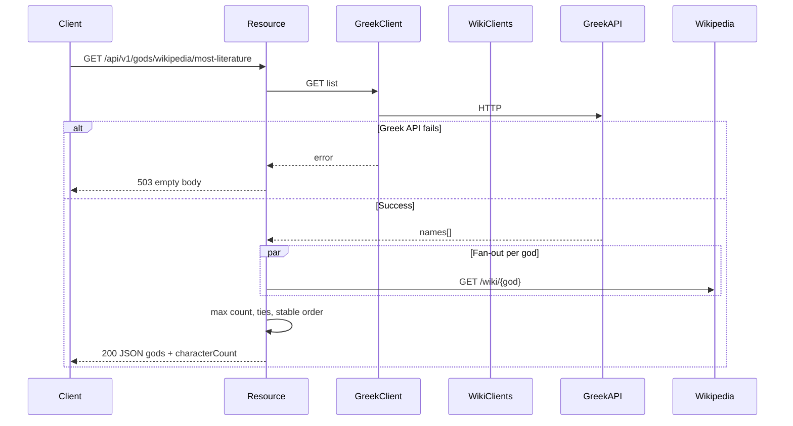
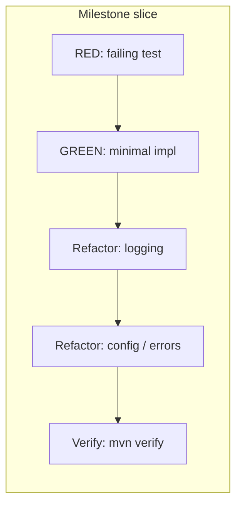

# US-001: God Analysis API — Implementation Plan

**Related:** [ADR-001](ADR-001-God-Analysis-API-Functional-Requirements.md) · [ADR-002](ADR-002-God-Analysis-API-Non-Functional-Requirements.md) · [ADR-003](ADR-003-God-Analysis-API-Technology-Stack.md) · [US-001 feature](US-001-Greek-Gods-Wikipedia-Information.feature) · [US-001](US-001-Greek-Gods-Wikipedia-Information.md)

## Requirements Summary

**User Story:** Expose an HTTP API that returns which Greek god(s) have the most Wikipedia article content (by character count of the HTTP response body), handling upstream failures per ADR-001.

**Key Business Rules:**

- **Greek API first:** `GET` list from Typicode-hosted Greek gods API; on failure (non-2xx, timeout, connection error) respond **503** with **empty body** (no JSON Problem Details).
- **Parallel Wikipedia:** For each god name, fetch Wikipedia HTML in parallel; **character count** = `String.length()` of the **full HTTP response body**.
- **Wikipedia failures:** Treat as count **0** and continue (no 503).
- **Winner selection:** God(s) with maximum count; on ties return **all** tied names sorted in **natural order** (e.g. `["Ares","Zeus"]` per feature).
- **NFRs (ADR-002):** Bounded connect/read timeouts, **no retries**, structured logging where useful, health endpoint.
- **Stack (ADR-003):** Quarkus 3.x, Java 26 in this module, blocking service layer (no Mutiny there), `@RunOnVirtualThread`, REST Assured + WireMock with **per-test** stub reset, JUnit `@Tag` aligned with Gherkin (`integration-test`, `acceptance-test`).

**Expected result:** `./mvnw clean verify` from [../implementation/](../implementation/) passes; tests use WireMock only (no live Typicode/Wikipedia in CI).

## Approach

**Strategy:** **London Style (outside-in) TDD** — start with a failing acceptance/integration test that hits the running Quarkus app (REST Assured + WireMock), then implement the resource boundary, then service and REST clients with narrower RED/GREEN cycles. After each GREEN slice, run Refactor (logging, then config/error-handling) before milestone verification.

**Runtime flow (sequence):**



**TDD / phase flow (London order within milestones):**



## Task List

| # | Task | Phase | TDD | Milestone | Parallel | Status |
|---|------|-------|-----|-----------|----------|--------|
| 1 | Maven: add `quarkus-rest-client-reactive`, `quarkus-smallrye-health`, test scope `wiremock`; align `quarkus-junit5`; set **groupId** `info.jab.ms`; decide Surefire-only vs Failsafe (`skipITs`); keep `maven.compiler.release` **26** | Setup | | | A1 | Done |
| 2 | `application.properties`: REST client keys `greek-gods-api` / `wikipedia-api`, base URLs, connect/read timeouts; `%test.` URLs to `http://localhost:${wiremock.port}` | Setup | | | A1 | Done |
| 3 | Implement `QuarkusTestResourceLifecycleManager`: start WireMock on dynamic port before Quarkus; publish `wiremock.port`; `resetAll()` in `@BeforeEach` | Setup | | | A1 | Done |
| 4 | RED: `@QuarkusTest` + REST Assured — one scenario stubs Greek + Wikipedia → expect **200** and JSON shape `gods` + `characterCount` | RED | Test | | A1 | Done |
| 5 | GREEN: Jakarta REST resource `GET /api/v1/gods/wikipedia/most-literature`, DTO (`gods`, `characterCount`), `@RunOnVirtualThread`, minimal happy path calling stubs | GREEN | Impl | | A1 | Done |
| 6 | Refactor: structured logging (categories under `info.jab.ms`, ADR-002) | Refactor | | | A1 | Done |
| 7 | Refactor: tighten timeouts / test profile wiring for WireMock | Refactor | | | A1 | Done |
| 8 | Verify milestone: `./mvnw clean verify` (or scoped module tests) | Verify | | milestone | A1 | Done |
| 9 | RED: tests for Greek REST client (`@Path` `/jabrena/latency-problems/greek` + base URL) | RED | Test | | A2 | Done |
| 10 | GREEN: `@RegisterRestClient` Greek client → `List<String>` / array type per contract | GREEN | Impl | | A2 | Done |
| 11 | RED: tests for Wikipedia client (`@PathParam` god, encoding) | RED | Test | | A2 | Done |
| 12 | GREEN: Wikipedia client returning `String` (HTML body) | GREEN | Impl | | A2 | Done |
| 13 | RED: service tests — fan-out, tie sort order, Wikipedia failure → 0, timeout/delay → 0 | RED | Test | | A2 | Done |
| 14 | GREEN: service — `CompletableFuture` + `Executors.newVirtualThreadPerTaskExecutor()`, map failures to 0, compute max + all ties | GREEN | Impl | | A2 | Done |
| 15 | Refactor: service logging and clear boundaries (Greek failure vs Wikipedia) | Refactor | | | A2 | Done |
| 16 | Refactor: resource maps Greek failure → `Response.status(503).build()` empty body; no Problem Details on this path | Refactor | | | A2 | Done |
| 17 | Verify milestone | Verify | | milestone | A2 | Done |
| 18 | RED: `@Tag("acceptance-test")` scenarios from feature — Zeus wins; Zeus down → Ares; three-way tie; Greek API down → **503** empty body (`body(emptyString())` or equivalent); optional Wikipedia delay > read timeout | RED | Test | | A3 | Done |
| 19 | GREEN: complete behaviors + `@Tag("integration-test")` slice if split | GREEN | Impl | | A3 | Done |
| 20 | Refactor: log levels / noise reduction for tests | Refactor | | | A3 | Done |
| 21 | Refactor: README, health smoke doc (`/q/health`) | Refactor | | | A3 | Done |
| 22 | Verify milestone: full `./mvnw clean verify` in `implementation/` | Verify | | milestone | A3 | Done |
| 23 | Remove `GreetingResource`, obsolete `GreetingResourceTest` / `GreetingResourceIT`; final doc touch | Setup | | | A4 | Done |

**Parallel column:** **A1** — test harness + first vertical slice; **A2** — clients + domain service; **A3** — acceptance coverage + hardening; **A4** — cleanup.

## Execution Instructions

When executing this plan:

1. Complete the current task.
2. **Update the Task List:** set the **Status** column for that task (e.g. Done or ✔).
3. **For GREEN tasks:** complete the associated **Verify** step for that milestone before treating the slice as done (see stability rules below).
4. **For Verify tasks:** ensure all tests pass and the build succeeds before proceeding.
5. **Milestone rows** (Milestone column): treat each **Verify milestone** as a gate — complete the **pair of Refactor tasks** (logging/observability, then config/error handling) immediately **before** each milestone Verify.
6. Only then proceed to the next task.
7. Repeat for all tasks. **Never advance without updating the plan Status column.**

**Critical stability rules:**

- After every GREEN implementation task in a slice, run tests; fix failures before Refactor.
- All tests must pass before milestone Verify completes.
- If any test fails during verification, fix before advancing.
- Never skip verification — it keeps the implementation stable.

## File Checklist

| Order | File |
|-------|------|
| 1 | [../implementation/pom.xml](../implementation/pom.xml) |
| 2 | [../implementation/src/main/resources/application.properties](../implementation/src/main/resources/application.properties) |
| 3 | `src/main/java/info/jab/ms/.../client/GreekGodsClient.java` (or equivalent package) |
| 4 | `src/main/java/info/jab/ms/.../client/WikipediaClient.java` |
| 5 | `src/main/java/info/jab/ms/.../model/...` (response DTO) |
| 6 | `src/main/java/info/jab/ms/.../service/GodAnalysisService.java` (or equivalent) |
| 7 | `src/main/java/info/jab/ms/.../rest/GodAnalysisResource.java` (or equivalent) |
| 8 | `src/test/java/.../WireMockQuarkusResource.java` (or name for `QuarkusTestResourceLifecycleManager`) |
| 9 | `src/test/java/.../*Test.java` / `*IT.java` / acceptance classes per tag strategy |
| 10 | `src/test/resources/wiremock/__files/` (optional) or inline stub bodies |
| 11 | [../implementation/README.md](../implementation/README.md) |

Replace placeholder paths with final names under **`info.jab.ms`**; remove [GreetingResource.java](../implementation/src/main/java/org/acme/GreetingResource.java) and obsolete tests under `org.acme`.

## Current state

- Scaffold: Quarkus BOM 3.34.1, `quarkus-rest`, `quarkus-junit`, REST Assured; [../implementation/pom.xml](../implementation/pom.xml) has `skipITs=true`.
- Code: placeholder [GreetingResource.java](../implementation/src/main/java/org/acme/GreetingResource.java) under `org.acme`; [application.properties](../implementation/src/main/resources/application.properties) is empty.
- ADRs require **base package `info.jab.ms`** (replace `org.acme`).

## Package layout (`info.jab.ms`)

| Area | Responsibility |
|------|----------------|
| `...client` | `@RegisterRestClient` interfaces: Greek gods `GET` → `List<String>` (or `String[]`); Wikipedia `GET` with `@PathParam` for `/wiki/{god}` returning `String` (HTML body). |
| `...api` or `...rest` | Jakarta REST resource: `GET /api/v1/gods/wikipedia/most-literature`, `@Produces(APPLICATION_JSON)`, `@RunOnVirtualThread`. |
| `...model` | Response DTO: `gods` (`List<String>`), `characterCount` (`long` or `int` — match JSON examples). |
| `...service` | Orchestration: fetch gods; `CompletableFuture.supplyAsync(..., Executors.newVirtualThreadPerTaskExecutor())` per god; map failures/timeouts to **0**; compute max and **all** names at max; **sort tie names** (natural order). |

**Character count rule:** Use **`String.length()`** on the Wikipedia **HTTP response body** (full body as returned). WireMock stubs in tests use exact lengths (100, 200, …) to match Gherkin.

**Greek API path:** `@Path("/jabrena/latency-problems/greek")` with base `https://my-json-server.typicode.com`.

**Greek API failure → 503 empty:** Non-2xx, timeout, or connection failure on Greek list → `Response.status(503).build()` with **no entity**.

**Wikipedia failure:** `WebApplicationException`, `ProcessingException`, or empty/error responses → count **0**, continue.

## Testing strategy (detail)

### WireMock lifecycle

- **`QuarkusTestResourceLifecycleManager`:** start WireMock on a dynamic port **before** Quarkus; publish **system properties** (e.g. `wiremock.port`) for `%test` URLs.
- **Per-test isolation:** `wireMockServer.resetAll()` in `@BeforeEach` (ADR-003).

### Tags and scenarios

- **`@Tag("integration-test")`** — e.g. Greek list retrieval scenario.
- **`@Tag("acceptance-test")`** — map each `@acceptance-test` Gherkin scenario: Zeus wins; Zeus unavailable → Ares; tie Ares/Zeus/Athena; Greek API unavailable → **503** empty body; optional Wikipedia delay beyond read timeout → 0 for that god.

Use **REST Assured** with `@QuarkusTest`; stub bodies under `src/test/resources/wiremock/__files/` or inline for exact lengths.

### Build plugins

- **`skipITs=true`** today skips Failsafe. Either run new tests as `*Test` under Surefire **or** set `skipITs=false` and use `*IT` only for packaged-mode tests.

## Verification

From `implementation/`:

```bash
./mvnw clean verify
```

Confirm: unit + integration + acceptance scenarios green; no reliance on live Typicode/Wikipedia in CI. Optional manual smoke against real URLs in dev profile.

## Notes

- **Tie-breaker:** Feature expects `["Ares", "Zeus"]` — use **sorted** god names for ties.
- **Wikipedia URL encoding:** Path params must encode names (spaces, etc.) — rely on JAX-RS `@PathParam` / client encoding behavior.
- **No retries:** Single attempt per call; timeouts → **0** for Wikipedia only (Greek failure → 503).
- **Optional Cursor Plan file:** For Plan mode, a sibling plan may also be saved as `.cursor/plans/US-001-plan-analysis.plan.md` — this requirements-folder document remains the **authoritative** traceability copy next to ADRs and Gherkin.

## Implementation checklist (quick)

- [ ] Production code under `info.jab.ms` with endpoint + service + REST clients + DTOs.
- [ ] `application.properties` with prod + `%test` overrides.
- [ ] Health extension enabled (smoke `/q/health`).
- [ ] WireMock + REST Assured tests with `@Tag("acceptance-test")` / `@Tag("integration-test")`.
- [ ] Remove demo `GreetingResource` and obsolete tests.
- [ ] Run `./mvnw clean verify` in `implementation/`.
- [ ] Task List Status column updated as work progresses.
