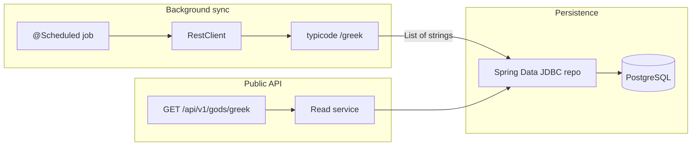

# US-001 Greek Gods API — implementation plan

**Story:** US-001 — API Greek Gods Data Retrieval  
**Target module:** [problem5/implementation1](../../implementation1) (from repo: `examples/requirements-examples/problem5/implementation1`)  
**Last updated:** 2026-03-26

## Traceability

| Artifact | Path |
|----------|------|
| Gherkin / acceptance criteria | [US-001_api_greek_gods_data_retrieval.feature](./US-001_api_greek_gods_data_retrieval.feature) |
| User story | [US-001_API_Greek_Gods_Data_Retrieval.md](./US-001_API_Greek_Gods_Data_Retrieval.md) |
| Functional ADR | [../design/ADR-001_REST_API_Functional_Requirements.md](../design/ADR-001_REST_API_Functional_Requirements.md) |
| Testing ADR | [../design/ADR-002-Acceptance-Testing-Strategy.md](../design/ADR-002-Acceptance-Testing-Strategy.md) |
| Technology stack ADR | [../design/ADR-003-Greek-Gods-API-Technology-Stack.md](../design/ADR-003-Greek-Gods-API-Technology-Stack.md) |
| Public API OpenAPI | [../design/greekController-oas.yaml](../design/greekController-oas.yaml) |
| External JSON server OpenAPI | [../design/my-json-server-oas.yaml](../design/my-json-server-oas.yaml) |
| Illustrative schema | [../design/schema.sql](../design/schema.sql) |

## Implementation checklist

- [ ] Extend `implementation1` POM: JDBC, Flyway, PostgreSQL driver, springdoc; test Testcontainers (optional JSONAssert, WireMock, Failsafe for `*IT`)
- [ ] Flyway V1 from `schema.sql`; Spring Data JDBC repository; `GET /api/v1/gods/greek`; empty database returns `200` and `[]`
- [ ] `@ControllerAdvice` / `ProblemDetail` for DB failures; `Content-Type` includes `application/problem+json`
- [ ] `RestClient` sync to `/greek` with timeouts; `@Scheduled` upsert; configuration properties
- [ ] `GreekGodsApiIT`: `RestClient` + `RANDOM_PORT` + `@Tag` mapping; `@Sql` seed; error, performance, concurrent tests
- [ ] springdoc aligned with `greekController-oas.yaml`; update HELP/README for PostgreSQL and how to run

## Current state

- [implementation1/pom.xml](../../implementation1/pom.xml): Spring Boot **4.0.5**, `webmvc` + Actuator, **no** JDBC, Flyway, PostgreSQL, or springdoc. Java **17** (ADR-003 cites 4.0.4 baseline — patch drift is acceptable; update ADR text only if you want strict lockstep).
- [Application.java](../../implementation1/src/main/java/com/example/demo/Application.java): empty shell; **no** endpoint, database, or sync.

## Target architecture

- **Read path (US-001 happy path):** Controller delegates to a service that loads all `name` values from `greek_god` (deterministic order, e.g. `ORDER BY name`) and returns `List<String>` as `application/json`.
- **Empty DB:** Return `200` with `[]` per ADR-001.
- **DB unavailable / query failure:** Return `500` with `application/problem+json` and RFC 7807 required members `type`, `title`, `status` (normative subset in the Gherkin feature). Use `@ControllerAdvice` with `ResponseEntityExceptionHandler` or map `DataAccessException` / `TransientDataAccessException` to `ProblemDetail`, consistent with ADR-001 and `greekController-oas.yaml`.

## Implementation layers (code)

| Layer | Responsibility |
|-------|----------------|
| **Flyway** | Migration matching `schema.sql`: table `greek_god (id SERIAL PK, name VARCHAR(100) NOT NULL UNIQUE)`. |
| **Entity / record** | Map row to a simple type; repository method to list all names. |
| **Sync service** | `RestClient` GET to base URL + `/greek` per `my-json-server-oas.yaml` (e.g. `https://my-json-server.typicode.com/jabrena/latency-problems/greek`). Deserialize `List<String>`; **upsert** names (idempotent). On failure: **log**, **no** automatic retries (ADR-003). |
| **Scheduling** | `@EnableScheduling`; fixed-rate or cron from config; optional `@ConditionalOnProperty` to disable in tests. |
| **REST** | `@RestController` on `/api/v1/gods/greek`; `GET` only; no authentication. |
| **Config** | `spring.datasource.*` for PostgreSQL; `app.sync.json-server.base-url` (or similar) plus connect/read timeouts on `RestClient.Builder` (ADR-003). |
| **OpenAPI** | springdoc-openapi; annotate controller so generated spec matches `greekController-oas.yaml` (operationId `getGreekGods`, 200 array of strings, 500 ProblemDetail). Optional CI validation later. |

**Package naming:** ADR-003 mentions `info.jab.latency` as illustrative; this module uses `com.example.demo`. Prefer `com.example.demo.gods` (or similar) unless you intentionally change `groupId` and base package.

## Maven dependencies (`implementation1/pom.xml`)

Per ADR-003:

- **Main:** `spring-boot-starter-data-jdbc`, PostgreSQL driver, `flyway-core` + `flyway-database-postgresql`, `springdoc-openapi-starter-webmvc-ui` (or Boot 4–compatible equivalent).
- **Test:** `spring-boot-starter-test` (via existing starters), `testcontainers-postgresql`, Testcontainers JUnit Jupiter; optional `jsonassert`; optional WireMock for deterministic sync tests.

Enable **Maven Failsafe** for `*IT.java` if you follow ADR-002 naming; otherwise document a single-lifecycle choice (e.g. Surefire only).

## Local / CI runtime

- **Docker:** Required for Testcontainers (ADR-002).
- **Developer PostgreSQL:** Optional `docker compose` or README with JDBC URL; tests should use Testcontainers with `@ServiceConnection` (or equivalent dynamic properties), not a mandatory host database.

## Testing map (Gherkin → JUnit)

Use **`RestClient`** (preferred) or **`TestRestTemplate`** with `@SpringBootTest(webEnvironment = RANDOM_PORT)` per ADR-002. Apply **`@Tag`** names aligned with the feature: `smoke`, `happy-path`, `performance`, `error-handling`, `load-testing`, `data-quality`, `api-specification`, `availability`.

| Scenario tag(s) | Automation approach |
|-----------------|---------------------|
| `@smoke` `@happy-path` | `@Sql` seed with 20 canonical names; `GET` → `200`, `Content-Type: application/json`, parse JSON array, exactly 20 entries, content equals expected set (per chosen ordering), no duplicates. |
| `@performance` | Measure elapsed ms for a single `GET`; assert &lt; 1000 (allow warm-up or small margin if flaky). |
| `@performance` `@load-testing` | 100 concurrent `GET`s; all `200`, each body has 20 names, wall-clock ≤ 2s (may be environment-sensitive). |
| `@error-handling` (DB down) | Stopped container, bad JDBC URL profile, or similar — expect `500`, `Content-Type` contains `application/problem+json`, JSON with non-empty `type`, `title`, and `status` 500 (do not require exact `detail`/`instance`). |
| `@error-handling` (empty DB) | Empty table → `200` and `[]`. |
| `@data-quality` | Optional WireMock for `/greek`; run sync; `GET` reflects stubbed data (avoids live typicode in CI). |
| `@api-specification` | Assert `200` + `application/json` + array of strings; optional OpenAPI / springdoc validation. |
| `@availability` | Not automatable as stated (24h / 99.9%); document as manual/observability or `@Disabled` with rationale. |

Place seed SQL under `src/test/resources/test-data/` (e.g. `greek-gods-seed.sql`) matching the feature’s god list.

## Phased delivery (ADR-001 implementation guidelines)

1. **Persistence + read API:** Flyway, repository, service, controller, datasource wiring; happy path + empty DB.
2. **Errors + RFC 7807:** Global handler; DB failure test.
3. **Sync:** RestClient + scheduler + config; optional WireMock test for `@data-quality`.
4. **Polish:** springdoc, performance/concurrent tests, HELP/README.

## Risks / decisions

- **Java version:** Example module uses **17**; root AGENTS.md references **Java 25** — align only if you want consistency with the monorepo.
- **Load test stability:** 100 requests in 2s may vary on CI; consider JMeter ([`.agents/skills/151-java-performance-jmeter/SKILL.md`](../../../../../.agents/skills/151-java-performance-jmeter/SKILL.md)) if ADR-002 Sprint 2 style is required.

## Definition of Done

Match [US-001 Definition of Done](./US-001_API_Greek_Gods_Data_Retrieval.md): endpoint implemented, automated coverage for all **implementable** Gherkin scenarios, OpenAPI accurate vs `greekController-oas.yaml`, `./mvnw verify` green for `implementation1`.
