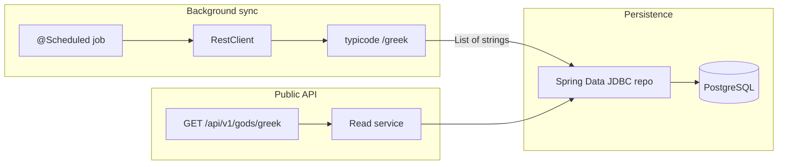

# US-001: Greek Gods Data Retrieval — implementation plan

This plan follows the structure and discipline defined in **[skills-generator/src/main/resources/skills/040-skill.xml](../../../../../skills-generator/src/main/resources/skills/040-skill.xml)** (skill id `040-planning-plan-mode`: Cursor Plan mode workflow, YAML frontmatter, required sections, London-style outside-in TDD order, Execution Instructions, and **Status** updates after each task). For expanded templates and constraints, see [skills/040-planning-plan-mode/references/040-planning-plan-mode.md](../../../../../skills/040-planning-plan-mode/references/040-planning-plan-mode.md).

**Story:** US-001 — API Greek Gods Data Retrieval  
**Target module:** [problem5/implementation1](../../implementation1) (repo path: `examples/requirements-examples/problem5/implementation1`)  
**Last updated:** 2026-03-26

> **Plan file location:** This copy lives under `requirements1/agile/` for epic/story traceability. Skill 040 also describes a Cursor-local path pattern `.cursor/plans/YYYY-MM-DD_<name>.plan.md` — use either; keep content in sync if both exist.

---

## Requirements Summary

**User Story:** As an API consumer, I want to retrieve the full list of Greek god names via `GET /api/v1/gods/greek` so that educational apps can integrate curated mythology data with fast, reliable access.

**Key business rules:**

- **Success:** `200`, `Content-Type: application/json`, body is a JSON array of strings; with seeded data, exactly **20** names matching the canonical list in [US-001_api_greek_gods_data_retrieval.feature](./US-001_api_greek_gods_data_retrieval.feature); deterministic order (e.g. `ORDER BY name`); no duplicates.
- **Empty database:** `200` and `[]` (not an error).
- **Database unavailable / access failure:** `500`, `Content-Type` includes `application/problem+json`, RFC 7807 **required** members `type` (non-empty string), `title` (non-empty string), `status` `500` (normative subset per [ADR-001](../design/ADR-001_REST_API_Functional_Requirements.md)); do not require byte-exact optional fields.
- **Sync:** Background job pulls from external `GET …/greek` ([my-json-server-oas.yaml](../design/my-json-server-oas.yaml)); persist with upsert; on upstream failure log and rely on next schedule tick — **no** automatic retry library (ADR-003).
- **Performance / load (automated):** Single request &lt; 1s; 100 concurrent GETs within 2s wall-clock where CI allows (see Notes).

**Traceability**

| Artifact | Path |
|----------|------|
| Gherkin | [US-001_api_greek_gods_data_retrieval.feature](./US-001_api_greek_gods_data_retrieval.feature) |
| User story | [US-001_API_Greek_Gods_Data_Retrieval.md](./US-001_API_Greek_Gods_Data_Retrieval.md) |
| ADR-001 / ADR-002 / ADR-003 | [../design/](../design/) |
| Public OpenAPI | [greekController-oas.yaml](../design/greekController-oas.yaml) |
| Upstream OpenAPI | [my-json-server-oas.yaml](../design/my-json-server-oas.yaml) |
| Schema | [schema.sql](../design/schema.sql) |

---

## Approach

**Strategy:** **London-style outside-in TDD** where practical: failing HTTP acceptance test first ([ADR-002](../design/ADR-002-Acceptance-Testing-Strategy.md)), then minimal implementation to green, then refactors; unit tests for non-trivial service/sync logic as needed.

**Stack:** Spring Boot **4.0.x** MVC, Spring Data JDBC, Flyway, PostgreSQL, `RestClient` for sync, springdoc-openapi ([ADR-003](../design/ADR-003-Greek-Gods-API-Technology-Stack.md)).

**Outside-in order (skill 040):** acceptance/integration test (RED) → controller/API slice (GREEN) → service tests (RED) → service (GREEN) → client/sync tests (RED) → sync client (GREEN) → refactor → `mvn verify`.

---

## Task List

| # | Task | Phase | TDD | Milestone | Parallel | Status |
|---|------|-------|-----|-----------|----------|--------|
| 1 | Add `spring-boot-starter-data-jdbc`, PostgreSQL driver, Flyway (+ PostgreSQL variant), springdoc; test Testcontainers, optional JSONAssert/WireMock/Failsafe | Setup | | | A1 | ✔ |
| 2 | `GreekGodsApiIT`: `@Tag("smoke")` `GET /api/v1/gods/greek` expects 200 + JSON array — **fails** until endpoint exists | RED | Test | | A1 | ✔ |
| 3 | Flyway `V1__*.sql` from [schema.sql](../design/schema.sql); entity/record + repository; `GreekGodsService`; `GreekGodsController` — **pass** smoke IT | GREEN | Impl | | A1 | ✔ |
| 4 | Add structured logging (read path, sync boundaries) | Refactor | | | A1 | ✔ |
| 5 | Externalize datasource + `RestClient` connect/read timeouts + sync base URL | Refactor | | | A1 | ✔ |
| 6 | Run `./mvnw verify` in `implementation1`; update frontmatter `todos` | Verify | | M1 | A1 | ✔ |
| 7 | IT: empty database → `200` `[]` | RED | Test | | A2 | ✔ |
| 8 | Confirm repository/service return empty list without error | GREEN | Impl | | A2 | ✔ |
| 9 | IT: simulate DB down → `500` + `application/problem+json` + normative Problem Detail fields | RED | Test | | A2 | ✔ |
| 10 | `@ControllerAdvice` / `ProblemDetail` for data access failures | GREEN | Impl | | A2 | ✔ |
| 11 | Refine problem `type`/`title` and test failure simulation profile | Refactor | | | A2 | ✔ |
| 12 | Refactor IT setup (containers, `@Sql`, profiles) for stable ordering | Refactor | | | A2 | ✔ |
| 13 | Run `./mvnw verify`; update `todos` | Verify | | M2 | A2 | ✔ |
| 14 | `RestClient` sync service + `@Scheduled` upsert; optional WireMock IT for `@data-quality` | RED/Impl | Test/Impl | | A3 | ✔ |
| 15 | Refactor sync logging and configuration | Refactor | | | A3 | ✔ |
| 16 | Refactor scheduling guards (`@ConditionalOnProperty` for tests) | Refactor | | | A3 | ✔ |
| 17 | Run `./mvnw verify` in `implementation1`; update frontmatter `todos`; set Status ✔ for rows 1–17 (last milestone — **M3** closes the plan) | Verify | | M3 | A3 | ✔ |

---

## Execution Instructions

When executing this plan:

1. Complete the **current** task row (or single `todo` in frontmatter).
2. **Update the Task List:** set the **Status** column for that task (e.g. ✔ or Done) before starting the next task.
3. **For GREEN tasks:** complete the associated **Verify** step (or next RED) before large refactors.
4. **For Verify tasks:** `./mvnw verify` (from `implementation1`) must pass before proceeding.
5. **Milestone rows (M1–M3):** complete the **pair of Refactor** rows immediately before each **Verify** milestone for that slice.
6. **Never advance** without updating Status (skill 040 constraint).
7. Repeat until row **17** is complete.

**Stability rules**

- After each substantive GREEN change, run tests (at least affected module).
- If verification fails, fix before moving on.
- **Parallel column (`A1`…`A3`):** groups tasks that belong to the same delivery slice (e.g. one agent/branch scope).

---

## File Checklist

| Order | File |
|-------|------|
| 1 | [implementation1/pom.xml](../../implementation1/pom.xml) |
| 2 | `implementation1/src/main/resources/db/migration/V1__create_greek_god.sql` |
| 3 | `implementation1/src/main/java/com/example/demo/gods/...` (entity/record, repository, service, controller — package as chosen) |
| 4 | `implementation1/src/main/java/.../config/` (RestClient bean, scheduling if separate) |
| 5 | `implementation1/src/main/java/.../sync/GreekGodsSyncService.java` (or equivalent) |
| 6 | `implementation1/src/main/java/.../web/GlobalExceptionHandler.java` (or equivalent) |
| 7 | `implementation1/src/main/resources/application.yml` (and `application-test.yml` if needed) |
| 8 | `implementation1/src/test/java/.../GreekGodsApiIT.java` |
| 9 | `implementation1/src/test/resources/test-data/greek-gods-seed.sql` |
| 10 | [implementation1/HELP.md](../../implementation1/HELP.md) or README |

---

## Testing map (Gherkin → JUnit)

Use **`RestClient`** (preferred) or **`TestRestTemplate`** with `@SpringBootTest(webEnvironment = RANDOM_PORT)` per ADR-002. Tags: `smoke`, `happy-path`, `performance`, `error-handling`, `load-testing`, `data-quality`, `api-specification`, `availability`.

| Scenario tag(s) | Automation approach |
|-----------------|---------------------|
| `@smoke` `@happy-path` | `@Sql` seed 20 names; assert 200, JSON array, count, set equality, no duplicates |
| `@performance` | Elapsed ms &lt; 1000 |
| `@performance` `@load-testing` | 100 concurrent GETs; all 200; 20 names each; wall-clock ≤ 2s |
| `@error-handling` | DB down / empty DB per Requirements Summary |
| `@data-quality` | WireMock + sync + GET reflects stub |
| `@api-specification` | 200 + `application/json` + string array; optional OpenAPI check |
| `@availability` | Manual/observability or `@Disabled` with rationale |

---

## Notes

- **Current state:** [Application.java](../../implementation1/src/main/java/com/example/demo/Application.java) is a shell; POM lacks JDBC/Flyway/PostgreSQL/springdoc ([pom.xml](../../implementation1/pom.xml)).
- **Package:** Prefer `com.example.demo.gods` unless changing `groupId` (ADR-003 illustrative `info.jab.latency`).
- **Java:** Module uses **17**; monorepo AGENTS may cite **25** — align only if required.
- **Load tests / springdoc / HELP:** Not in the numbered task list (polish and duplicate final-verify rows were removed); add a follow-up task if you still want `@performance` / `@load-testing` ITs, springdoc vs [greekController-oas.yaml](../design/greekController-oas.yaml), or HELP/README updates. JMeter option: [.agents skill 151](../../../../../.agents/skills/151-java-performance-jmeter/SKILL.md).
- **Definition of done:** [US-001_API_Greek_Gods_Data_Retrieval.md](./US-001_API_Greek_Gods_Data_Retrieval.md) checklist + OpenAPI parity with `greekController-oas.yaml` (may require the optional follow-up above).

---

## Skill 040 plan creation checklist

Before considering this plan final, confirm (from `040-skill.xml` / reference doc):

- [x] Frontmatter: `name`, `overview`, `todos`, `isProject`
- [x] Requirements Summary with user story and key rules
- [x] Approach names strategy and includes Mermaid
- [x] Task List: #, Task, Phase, TDD, Milestone, Parallel, **Status**
- [x] Execution Instructions with stability rules and milestone workflow
- [x] File Checklist: Order, File
- [x] Notes: package, conventions, edge cases
