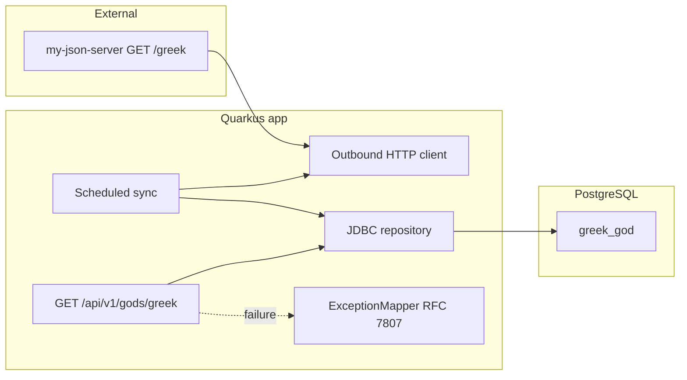

# Problem 5: US-001 Greek Gods API Implementation Plan

**Artifacts:** [US-001_API_Greek_Gods_Data_Retrieval.md](US-001_API_Greek_Gods_Data_Retrieval.md) · [US-001_api_greek_gods_data_retrieval.feature](US-001_api_greek_gods_data_retrieval.feature) · **Last updated:** 2026-03-26

> **Plan file location:** This document lives under `requirements2/agile/` for the example. The skill default for Cursor Plan mode is `.cursor/plans/US-001-plan-analysis.plan.md`; keep both in sync if you duplicate.

---

## Requirements Summary

**User Story:** As an API consumer, I want to retrieve the full list of Greek god names via **`GET /api/v1/gods/greek`** so educational apps can integrate curated mythology data with fast, reliable access that does not depend on the external JSON server at read time.

**Key business rules:**

- **Read path:** Responses come **only** from PostgreSQL. **200** + `application/json` array of strings; **empty table → 200** + `[]` (not 5xx).
- **Sync path:** Background job fetches `GET …/greek` (see [my-json-server-oas.yaml](../design/my-json-server-oas.yaml)), parses array of strings, **upserts** into `greek_god` by unique `name`; log failures; **no** retry library in v1 ([ADR-003](../design/ADR-003-Greek-Gods-API-Technology-Stack.md)).
- **Errors:** DB unreachable on read → **500** + **`application/problem+json`** with **`type`**, **`title`**, **`status`** (normative subset per [ADR-001](../design/ADR-001_REST_API_Functional_Requirements.md)).
- **Contract:** Deterministic ordering for tests (e.g. `ORDER BY name`); happy path asserts **20** canonical names with **no duplicates** (set equality, e.g. AssertJ `containsExactlyInAnyOrder`).
- **Testing:** [ADR-002](../design/ADR-002-Acceptance-Testing-Strategy.md) — **`@QuarkusTest`** + **REST Assured**; JUnit **`@Tag`** matches Gherkin tags; PostgreSQL via **Testcontainers** or documented Dev Services.
- **OpenAPI:** Runtime spec aligned with [greekController-oas.yaml](../design/greekController-oas.yaml).
- **Schema:** [schema.sql](../design/schema.sql) — `greek_god (id SERIAL PK, name VARCHAR(100) NOT NULL UNIQUE)`.

**Non-goals:** Automate **@availability** (24 h / 99.9%) in ITs; change **implementation1** (Spring); add resilience/retry stack for outbound sync in v1.

---

## Approach

**Strategy:** **London Style (outside-in) TDD** — start with a failing HTTP acceptance test (`@QuarkusTest` + REST Assured), implement the smallest vertical slice (Flyway + JDBC + resource), then add sync behind the same contract; refactor logging and configuration before each milestone **Verify**.

**Module:** [implementation2](../../implementation2/) (Quarkus 3.x). Enable Failsafe / clear `<skipITs>` when `*IT.java` exist.

**Detail:** [greek_gods_api_sequence_diagram.puml](../design/greek_gods_api_sequence_diagram.puml)

---

## Task List

| # | Task | Phase | TDD | Milestone | Parallel | Status |
|---|------|-------|-----|-----------|----------|--------|
| 1 | Extend **implementation2** `pom.xml`: `quarkus-rest`, JDBC PostgreSQL, Flyway, scheduler, SmallRye OpenAPI, outbound HTTP client dep (or JDK client only), `rest-assured`, Testcontainers, Failsafe for `*IT`; plan `%test` datasource | Setup | | | A1 | Done |
| 2 | **RED:** `GreekGodsApiIT` — REST Assured `GET /api/v1/gods/greek` expects **200**, JSON array, 20 canonical names (set equality), no duplicates (fails until slice exists) | RED | Test | | A1 | Done |
| 3 | **GREEN:** Flyway migration matching [schema.sql](../design/schema.sql); seed 20 names (Flyway test data / IT setup); JDBC repository `findAllNamesOrdered()`; Jakarta REST resource; no external call on read path | GREEN | Impl | | A1 | Done |
| 4 | **Refactor:** Structured logging (read path): request or repo boundaries per team standard | Refactor | | | A1 | Done |
| 5 | **Refactor:** `ExceptionMapper` for persistence failures → 500 `application/problem+json`; empty DB IT → 200 `[]`; invalid JDBC / container stop for 500 shape; external base URL property (no hard-coded URL) | Refactor | | | A1 | Done |
| 6 | **Verify:** `./mvnw clean verify` in **implementation2**; fix failures before M2 | Verify | | milestone | A1 | Done |
| 7 | **RED:** Failing test for sync: WireMock (or stub) returns JSON array; assert upsert updates DB (unit or `@QuarkusTest` with test resource) | RED | Test | | A2 | Done |
| 8 | **GREEN:** Implement outbound client for `/greek`; `@Scheduled` job: fetch, parse, upsert by `name`; failure logging only | GREEN | Impl | | A2 | Done |
| 9 | **Refactor:** Logging for sync failures (level, no secrets); correlation-friendly messages | Refactor | | | A2 | Done |
| 10 | **Refactor:** Scheduler interval / cron via config; test overrides; tighten error handling at client boundary | Refactor | | | A2 | Done |
| 11 | **Verify:** `./mvnw clean verify`; sync + data-quality scenarios green | Verify | | milestone | A2 | Done |
| 12 | **RED:** Failing IT or assertion for OpenAPI fragment / `@api-specification` (Content-Type, array of strings) | RED | Test | | A3 | Done |
| 13 | **GREEN:** Annotate SmallRye OpenAPI to match [greekController-oas.yaml](../design/greekController-oas.yaml); add `@Tag` ITs: `performance` (&lt;1s), `load-testing` (100 concurrent, wall &lt;2s per feature — document CI tolerance), `data-quality` (post-stub sync) | GREEN | Impl | | A3 | Done |
| 14 | **Refactor:** Observability for public API (optional metrics hooks); OpenAPI tags/descriptions | Refactor | | | A3 | Done |
| 15 | **Refactor:** Maven profiles / `-Dgroups` alignment with `@Tag`; `skipITs` default vs CI; README for run commands | Refactor | | | A3 | Done |
| 16 | **Verify:** Full `./mvnw clean verify`; confirm US-001 DoD and Gherkin coverage except **@availability** (ops/SLO) | Verify | | milestone | A3 | Done |

---

## Execution Instructions

When executing this plan:

1. Complete the current task.
2. **Update the Task List:** set the **Status** column for that task (e.g. ✔ or Done).
3. **For GREEN tasks:** MUST complete the associated **Verify** task before proceeding to the next milestone slice (after Refactor pair).
4. **For Verify tasks:** MUST ensure all tests pass and the build succeeds before proceeding.
5. **Milestone rows** (**Milestone** column): a milestone is evolving complete software for that slice — complete the **pair of Refactor** tasks (logging, then optimize config/error handling) **immediately before** each **milestone Verify**.
6. Only then proceed to the next task.
7. Repeat for all tasks. Never advance without updating the plan.

**Critical stability rules:**

- After every **GREEN** implementation task, run verification before leaving that milestone (after the two Refactor rows and **Verify**).
- All tests must pass before proceeding; if any test fails, fix before advancing.
- Never skip **Verify** steps.

**Parallel column:** **A1** = read API + DB + error/empty paths; **A2** = outbound sync; **A3** = OpenAPI + extended tags + build/CI polish.

---

## File Checklist

| Order | File |
|-------|------|
| 1 | `examples/requirements-examples/problem5/implementation2/pom.xml` |
| 2 | `examples/requirements-examples/problem5/implementation2/src/main/resources/application.properties` |
| 3 | `examples/requirements-examples/problem5/implementation2/src/main/resources/db/migration/V1__greek_god.sql` (or equivalent Flyway version) |
| 4 | `examples/requirements-examples/problem5/implementation2/src/main/java/.../gods/GreekGodRepository.java` (or package chosen) |
| 5 | `examples/requirements-examples/problem5/implementation2/src/main/java/.../gods/resource/GreekGodsResource.java` |
| 6 | `examples/requirements-examples/problem5/implementation2/src/main/java/.../gods/repository/GreekGodsExceptionMapper.java` |
| 7 | `examples/requirements-examples/problem5/implementation2/src/main/java/.../gods/service/GreekGodsUpstreamClient.java` (REST Client interface) |
| 8 | `examples/requirements-examples/problem5/implementation2/src/main/java/.../gods/service/GreekGodsSyncJob.java` |
| 9 | `examples/requirements-examples/problem5/implementation2/src/test/java/.../GreekGodsApiIT.java` |
| 10 | `examples/requirements-examples/problem5/implementation2/src/test/java/.../GreekGodsSyncIT.java` or `...Test.java` (sync + WireMock) |
| 11 | `examples/requirements-examples/problem5/implementation2/src/test/resources/application.properties` (or `application-test.properties`) |
| 12 | `examples/requirements-examples/problem5/implementation2/README.md` (run, config, tags) |

Adjust package `...` to match the module (e.g. `info.jab.ms.gods`).

---

## Notes

- **Gherkin → `@Tag`:** `smoke`, `happy-path`, `performance`, `load-testing`, `error-handling`, `data-quality`, `api-specification`, `availability` (document only) — see [ADR-002 §2](../design/ADR-002-Acceptance-Testing-Strategy.md).
- **Risks:** Flaky public JSON server in CI → prefer WireMock for sync tests; perf thresholds on shared runners → optional `@EnabledIfEnvironmentVariable` or nightly profile.
- **Commands:** `cd examples/requirements-examples/problem5/implementation2 && ./mvnw clean verify`; enable ITs with `-DskipITs=false` or profile while `skipITs` is true in the skeleton POM.

### Related documentation

| Artifact | Path |
|----------|------|
| User story | [US-001_API_Greek_Gods_Data_Retrieval.md](US-001_API_Greek_Gods_Data_Retrieval.md) |
| Gherkin | [US-001_api_greek_gods_data_retrieval.feature](US-001_api_greek_gods_data_retrieval.feature) |
| ADR-001 | [../design/ADR-001_REST_API_Functional_Requirements.md](../design/ADR-001_REST_API_Functional_Requirements.md) |
| ADR-002 | [../design/ADR-002-Acceptance-Testing-Strategy.md](../design/ADR-002-Acceptance-Testing-Strategy.md) |
| ADR-003 | [../design/ADR-003-Greek-Gods-API-Technology-Stack.md](../design/ADR-003-Greek-Gods-API-Technology-Stack.md) |
| Public OpenAPI | [../design/greekController-oas.yaml](../design/greekController-oas.yaml) |
| External OpenAPI | [../design/my-json-server-oas.yaml](../design/my-json-server-oas.yaml) |
| Schema | [../design/schema.sql](../design/schema.sql) |

### Tag / scenario matrix (implementation hint)

| Gherkin focus | Automation |
|---------------|------------|
| `@smoke` / `@happy-path` | REST Assured + AssertJ set equality for 20 names |
| `@performance` | Single GET timed &lt; 1 s |
| `@load-testing` | 100 concurrent GETs; wall &lt; 2 s (tune for CI) |
| `@error-handling` | 500 problem+json; empty → `[]` |
| `@data-quality` | After stubbed sync, API matches upstream payload |
| `@api-specification` | Headers + optional schema vs OpenAPI |
| `@availability` | Production SLO / monitoring — not automated here |
