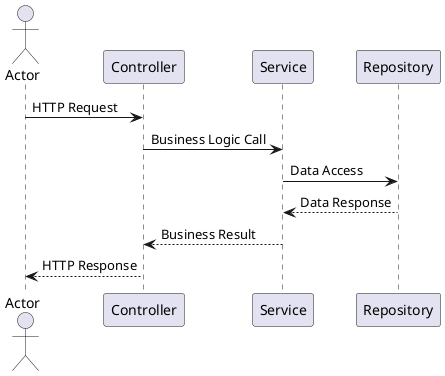

# Java Diagrams Generator with modular step-based configuration

Generate comprehensive Java project diagrams through a modular, step-based interactive process that covers UML sequence diagrams, UML class diagrams, C4 model diagrams, UML state machine diagrams, and ER (Entity Relationship) diagrams using PlantUML syntax. **This is an interactive SKILL**.

**What is covered in this Skill?**

- UML sequence diagram generation for application workflows and API interactions
- UML class diagram generation for package structure and class relationships
- C4 model diagram generation at Context/Container/Component levels only (levels 1–3; Code/Level 4 not generated)
- UML state machine diagram generation for entity lifecycles and business workflows
- ER diagram generation from SQL schema (DDL, migrations) using PlantUML Chen notation
- PlantUML syntax for all diagram types
- File organization strategies: single-file, separate-files, or integrated with existing documentation
- Final diagram validation with PlantUML syntax checking

## Workflow

1. **Validate project**: Run `./mvnw validate` or `mvn validate` to ensure the project is in a valid state
2. **Ask about diagram type**: Present the user with diagram options (sequence, class, C4, state machine, ER) and gather their selection
3. **Gather context**: Ask follow-up questions about scope, detail level, and file organization preferences
4. **Generate PlantUML**: Analyze the codebase and produce PlantUML source files based on the user's selections
5. **Validate syntax**: Review generated `.puml` files for correct PlantUML syntax and offer to render or integrate with documentation

## Quick Reference

**PlantUML sequence diagram for a typical API flow:**

## Constraints

Before applying any diagram generation, ensure the project validates. If validation fails, stop immediately — do not proceed until all validation errors are resolved.

- **MANDATORY**: Run `./mvnw validate` or `mvn validate` before applying any diagram generation
- **SAFETY**: If validation fails, stop immediately — do not proceed until all validation errors are resolved
- **BEFORE APPLYING**: Read the reference for detailed good/bad examples, constraints, and safeguards for each diagram generation pattern
- **C4 LIMIT**: C4 diagrams restricted to levels 1, 2, 3 only (Context, Container, Component); never generate Level 4 (Code) diagrams

## When to use this skill

- Generate UML diagram
- Create sequence diagram
- Create class diagram
- Create state machine diagram
- Create C4 diagram
- Generate ER diagram

## Reference

For detailed guidance, examples, and constraints, see [references/033-architecture-diagrams.md](references/033-architecture-diagrams.md).
